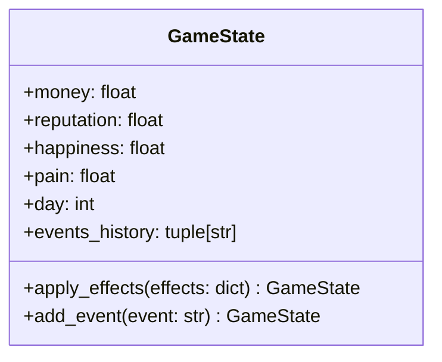
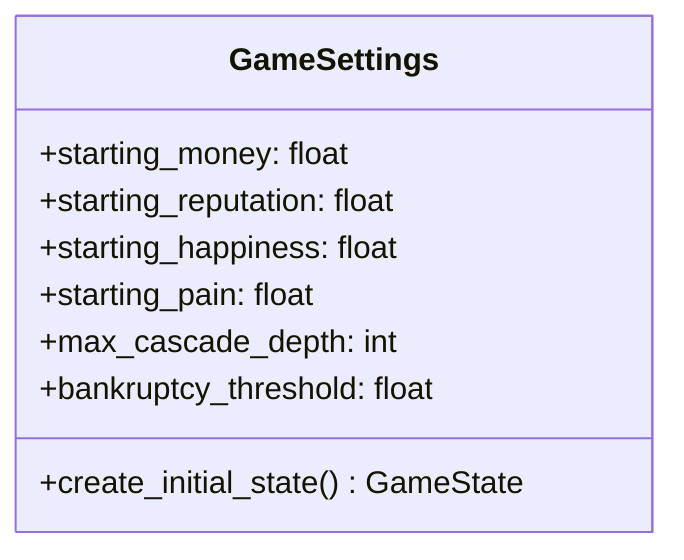
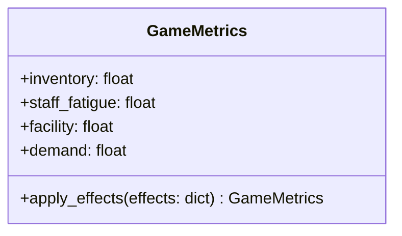

# 코어 도메인 설계

## 1. 도메인 모델

### 1.1 GameState


### 1.2 GameSettings


### 1.3 GameMetrics


## 2. 값 객체

### 2.1 MetricValue
```python
@dataclass(frozen=True)
class MetricValue:
    name: str
    value: float
    min_value: float
    max_value: float
```

### 2.2 EventEffect
```python
@dataclass(frozen=True)
class EventEffect:
    metric: str
    value: float
    type: str
```

## 3. 도메인 이벤트

### 3.1 GameEvent
```python
@dataclass(frozen=True)
class GameEvent:
    id: str
    type: str
    effects: list[EventEffect]
    timestamp: datetime
```

## 4. 도메인 서비스

### 4.1 GameStateService
```python
class GameStateService:
    """게임 상태 관리 서비스"""
    def apply_effects(state: GameState, effects: dict) -> GameState
    def validate_state(state: GameState) -> bool
    def calculate_metrics(state: GameState) -> dict
```

### 4.2 MetricsService
```python
class MetricsService:
    """게임 지표 관리 서비스"""
    def update_metrics(metrics: GameMetrics, effects: dict) -> GameMetrics
    def validate_metrics(metrics: GameMetrics) -> bool
    def calculate_derived_metrics(metrics: GameMetrics) -> dict
```

## 5. 도메인 규칙

### 5.1 상태 제약조건
- 모든 수치는 음수가 될 수 없음
- 평판, 행복도, 고통은 0-100 사이의 값
- 재고는 0-999 사이의 값
- 일수는 1 이상의 정수

### 5.2 이벤트 제약조건
- 모든 이벤트는 고유 ID를 가짐
- 이벤트 효과는 즉시 적용
- 이벤트 히스토리는 불변

### 5.3 메트릭스 제약조건
- 모든 지표는 정의된 범위 내의 값
- 지표 변경은 이벤트를 통해서만 가능
- 파생 지표는 실시간 계산

## 6. 확장 포인트

### 6.1 새로운 지표 추가
```python
class MetricDefinition:
    """새로운 지표 정의"""
    name: str
    initial_value: float
    min_value: float
    max_value: float
    calculation_rule: Callable
```

### 6.2 새로운 이벤트 타입
```python
class EventTypeDefinition:
    """새로운 이벤트 타입 정의"""
    type_name: str
    effects_handler: Callable
    validation_rules: list[Callable]
```

## 7. 예외 처리

### 7.1 도메인 예외
```python
class DomainException(Exception):
    """도메인 규칙 위반 예외"""
    pass

class InvalidStateException(DomainException):
    """잘못된 상태 예외"""
    pass

class InvalidMetricException(DomainException):
    """잘못된 지표 예외"""
    pass
```

## 8. 테스트 시나리오

### 8.1 상태 변경 테스트
- 정상적인 상태 변경
- 경계값 테스트
- 잘못된 변경 시도

### 8.2 이벤트 처리 테스트
- 이벤트 효과 적용
- 연쇄 효과 처리
- 예외 상황 처리

### 8.3 지표 계산 테스트
- 기본 지표 계산
- 파생 지표 계산
- 지표 범위 검증 