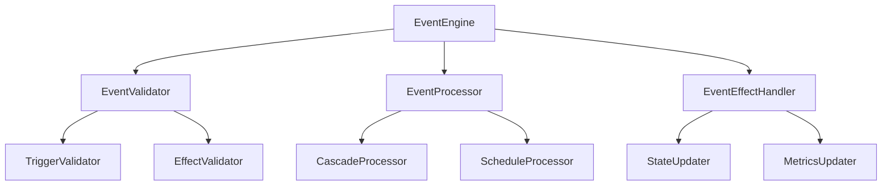
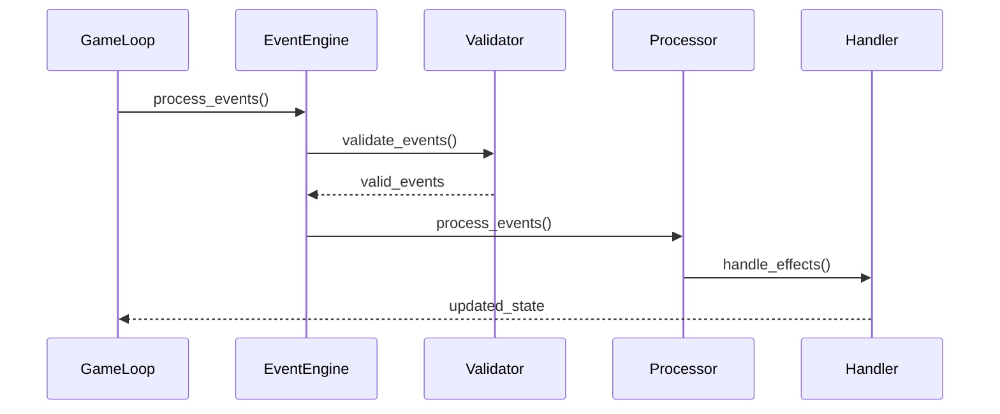
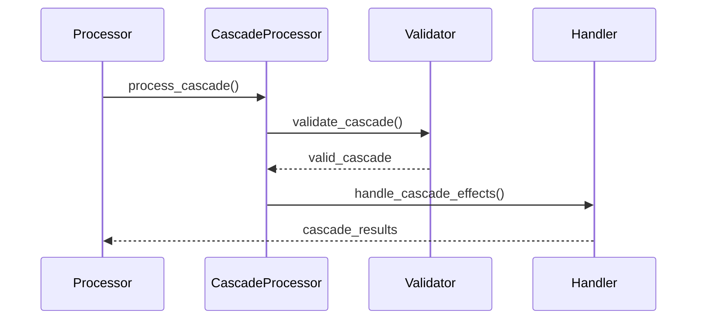

# 이벤트 시스템 설계

## 1. 이벤트 엔진 구조

### 1.1 핵심 컴포넌트


## 2. 이벤트 모델

### 2.1 이벤트 정의
```python
@dataclass(frozen=True)
class Event:
    id: str
    type: EventType
    trigger_conditions: list[TriggerCondition]
    effects: list[EventEffect]
    cooldown: Optional[CooldownConfig]
    cascade_config: Optional[CascadeConfig]
    schedule_config: Optional[ScheduleConfig]
```

### 2.2 트리거 조건
```python
@dataclass(frozen=True)
class TriggerCondition:
    type: TriggerType
    metric: str
    value: float
    range_min: Optional[float]
    range_max: Optional[float]
```

### 2.3 이벤트 효과
```python
@dataclass(frozen=True)
class EventEffect:
    metric: str
    value: float
    effect_type: EffectType
```

## 3. 이벤트 처리 흐름

### 3.1 기본 처리 흐름


### 3.2 연쇄 이벤트 처리


## 4. 검증 시스템

### 4.1 트리거 검증
```python
class TriggerValidator:
    """트리거 조건 검증기"""
    def validate_condition(condition: TriggerCondition, state: GameState) -> bool
    def validate_range(condition: TriggerCondition, value: float) -> bool
```

### 4.2 효과 검증
```python
class EffectValidator:
    """이벤트 효과 검증기"""
    def validate_effect(effect: EventEffect, state: GameState) -> bool
    def validate_cascade(effect: EventEffect, depth: int) -> bool
```

## 5. 쿨다운 시스템

### 5.1 쿨다운 설정
```python
@dataclass(frozen=True)
class CooldownConfig:
    duration: int
    category: Optional[str]
    scope: CooldownScope
```

### 5.2 쿨다운 관리
```python
class CooldownManager:
    """쿨다운 관리자"""
    def add_cooldown(event_id: str, config: CooldownConfig)
    def check_cooldown(event_id: str) -> bool
    def update_cooldowns()
```

## 6. 스케줄링 시스템

### 6.1 스케줄 설정
```python
@dataclass(frozen=True)
class ScheduleConfig:
    trigger_day: int
    repeat_interval: Optional[int]
    conditions: list[TriggerCondition]
```

### 6.2 스케줄 관리
```python
class ScheduleManager:
    """스케줄 관리자"""
    def schedule_event(event_id: str, config: ScheduleConfig)
    def get_scheduled_events(current_day: int) -> list[str]
    def update_schedule()
```

## 7. 확장성

### 7.1 새로운 트리거 타입
```python
class CustomTrigger(TriggerCondition):
    """사용자 정의 트리거"""
    def evaluate(state: GameState) -> bool
```

### 7.2 새로운 효과 타입
```python
class CustomEffect(EventEffect):
    """사용자 정의 효과"""
    def apply(state: GameState) -> GameState
```

## 8. 예외 처리

### 8.1 이벤트 예외
```python
class EventException(Exception):
    """이벤트 처리 예외"""
    pass

class InvalidTriggerException(EventException):
    """잘못된 트리거 예외"""
    pass

class InvalidEffectException(EventException):
    """잘못된 효과 예외"""
    pass
```

## 9. 테스트 전략

### 9.1 단위 테스트
- 트리거 조건 검증
- 효과 적용 검증
- 쿨다운 관리
- 스케줄 관리

### 9.2 통합 테스트
- 이벤트 처리 흐름
- 연쇄 이벤트 처리
- 상태 업데이트
- 예외 처리

### 9.3 성능 테스트
- 대량 이벤트 처리
- 연쇄 이벤트 깊이
- 메모리 사용량
- 처리 시간 