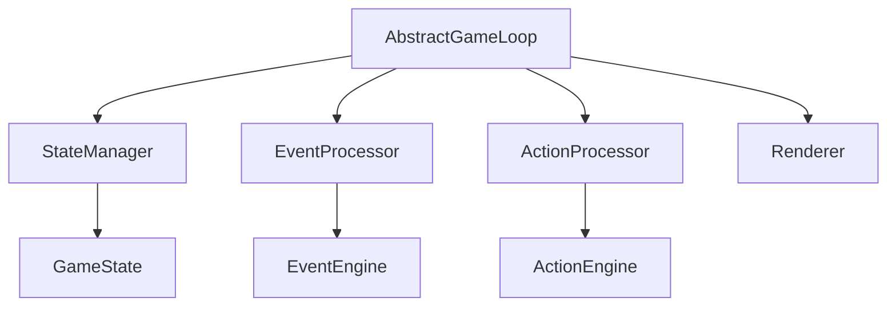
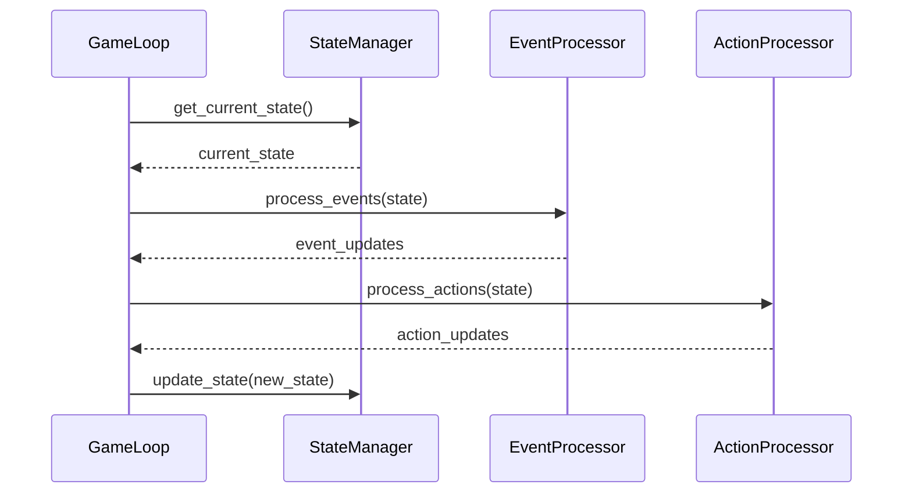
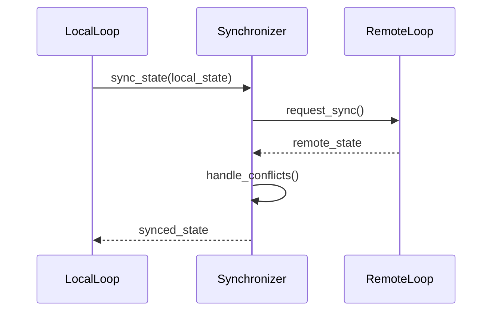

# 게임 루프 설계

## 1. 게임 루프 구조

### 1.1 핵심 컴포넌트


## 2. 게임 루프 인터페이스

### 2.1 추상 게임 루프
```python
class AbstractGameLoop:
    """게임 루프 추상 클래스"""
    def initialize(self)
    def start(self)
    def stop(self)
    def pause(self)
    def resume(self)
    def process_events(self)
    def update(self)
    def render(self)
```

### 2.2 MUD 게임 루프
```python
class MUDGameLoop(AbstractGameLoop):
    """텍스트 기반 게임 루프"""
    def process_command(self, command: str)
    def display_status(self)
    def display_events(self)
    def display_actions(self)
```

### 2.3 웹 게임 루프
```python
class WebGameLoop(AbstractGameLoop):
    """웹 기반 게임 루프"""
    def handle_request(self, request: Request)
    def send_update(self, update: GameUpdate)
    def broadcast_event(self, event: GameEvent)
```

## 3. 상태 관리

### 3.1 상태 관리자
```python
class StateManager:
    """게임 상태 관리자"""
    def get_current_state() -> GameState
    def update_state(new_state: GameState)
    def save_state()
    def load_state()
```

### 3.2 상태 업데이트 흐름


## 4. 이벤트 처리

### 4.1 이벤트 프로세서
```python
class EventProcessor:
    """이벤트 처리기"""
    def process_events(state: GameState) -> list[EventUpdate]
    def handle_scheduled_events()
    def handle_triggered_events()
```

### 4.2 이벤트 업데이트
```python
@dataclass(frozen=True)
class EventUpdate:
    event_id: str
    effects: list[EventEffect]
    timestamp: datetime
```

## 5. 액션 처리

### 5.1 액션 프로세서
```python
class ActionProcessor:
    """액션 처리기"""
    def process_action(action: GameAction, state: GameState) -> ActionResult
    def validate_action(action: GameAction, state: GameState) -> bool
    def apply_action_effects(action: GameAction, state: GameState) -> GameState
```

### 5.2 액션 결과
```python
@dataclass(frozen=True)
class ActionResult:
    success: bool
    effects: list[ActionEffect]
    message: str
```

## 6. 렌더링 시스템

### 6.1 렌더러 인터페이스
```python
class Renderer:
    """렌더링 인터페이스"""
    def render_state(state: GameState)
    def render_events(events: list[GameEvent])
    def render_actions(actions: list[GameAction])
```

### 6.2 MUD 렌더러
```python
class MUDRenderer(Renderer):
    """텍스트 기반 렌더러"""
    def format_state(state: GameState) -> str
    def format_event(event: GameEvent) -> str
    def format_action(action: GameAction) -> str
```

### 6.3 웹 렌더러
```python
class WebRenderer(Renderer):
    """웹 기반 렌더러"""
    def create_state_view(state: GameState) -> dict
    def create_event_view(event: GameEvent) -> dict
    def create_action_view(action: GameAction) -> dict
```

## 7. 동기화 시스템

### 7.1 상태 동기화
```python
class StateSynchronizer:
    """상태 동기화 관리자"""
    def sync_state(state: GameState)
    def handle_conflicts(local: GameState, remote: GameState) -> GameState
    def validate_sync(state: GameState) -> bool
```

### 7.2 동기화 흐름


## 8. 예외 처리

### 8.1 게임 루프 예외
```python
class GameLoopException(Exception):
    """게임 루프 예외"""
    pass

class StateUpdateException(GameLoopException):
    """상태 업데이트 예외"""
    pass

class RenderException(GameLoopException):
    """렌더링 예외"""
    pass
```

## 9. 테스트 전략

### 9.1 단위 테스트
- 상태 관리 테스트
- 이벤트 처리 테스트
- 액션 처리 테스트
- 렌더링 테스트

### 9.2 통합 테스트
- 게임 루프 흐름 테스트
- 상태 동기화 테스트
- 예외 처리 테스트

### 9.3 성능 테스트
- 루프 처리 시간
- 메모리 사용량
- 동시성 처리
- 네트워크 지연 