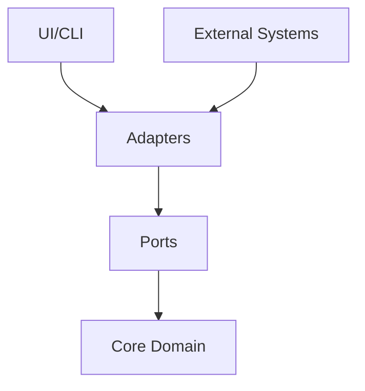

# 아키텍처 개요

## 헥사고날 아키텍처

Chicken-RNG는 헥사고날 아키텍처(Ports & Adapters)를 기반으로 설계되었습니다. 이 아키텍처는 다음과 같은 장점을 제공합니다:

- 도메인 로직의 순수성 유지
- 외부 시스템과의 결합도 감소
- 테스트 용이성 향상
- 유지보수성 개선

## 계층 구조



### Core Domain
- 순수한 도메인 로직
- 비즈니스 규칙
- 엔티티와 값 객체

### Ports
- 인터페이스 정의
- 외부 시스템과의 계약
- 의존성 역전

### Adapters
- 외부 시스템 연동
- 데이터 변환
- 프로토콜 처리

## 주요 모듈

### 1. Core
- Domain Models
- Business Rules
- Value Objects
- Entities

### 2. Application
- Use Cases
- Services
- DTOs
- Mappers

### 3. Infrastructure
- Repositories
- External Services
- Frameworks
- Libraries

### 4. Interfaces
- Controllers
- Views
- CLI Commands
- API Endpoints

## 의존성 규칙

1. 외부에서 내부로의 의존성
2. 도메인 중심 설계
3. 인터페이스를 통한 통신
4. 관심사의 분리

## 파일 구조

```
src/
├── core/              # 핵심 도메인
│   ├── domain/        # 엔티티 & 값 객체
│   └── ports/         # 인터페이스
├── adapters/          # 어댑터
├── application/       # 응용 서비스
├── economy/          # 경제 시스템
├── events/           # 이벤트 엔진
└── metrics/          # 지표 관리
```

## 모듈 간 통신

### 동기 통신
- 직접 메서드 호출
- 인터페이스 기반 통신
- DTO를 통한 데이터 전달

### 비동기 통신
- 이벤트 기반 통신
- 메시지 큐
- 발행-구독 패턴

## 확장성

### 플러그인 아키텍처
- 동적 모듈 로딩
- 확장 포인트
- 인터페이스 기반 통합

### 설정 관리
- 환경 변수
- 설정 파일
- 동적 설정

## 보안

### 인증 & 인가
- API 키 관리
- 접근 제어
- 권한 관리

### 데이터 보안
- 민감 정보 처리
- 암호화
- 로깅

## 성능

### 최적화
- 캐싱 전략
- 메모리 관리
- 병렬 처리

### 모니터링
- 성능 메트릭
- 로그 추적
- 알림 시스템

## 테스트 전략

### 단위 테스트
- 도메인 로직
- 유스케이스
- 값 객체

### 통합 테스트
- 어댑터
- 외부 시스템
- E2E 시나리오

## 배포

### CI/CD
- 자동화된 빌드
- 테스트 실행
- 품질 검사

### 환경 관리
- 개발
- 스테이징
- 프로덕션

## 유지보수

### 문서화
- API 문서
- 아키텍처 결정
- 운영 가이드

### 모니터링
- 로그 관리
- 성능 추적
- 오류 보고 