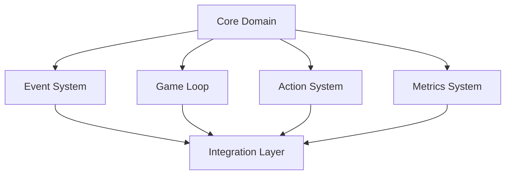
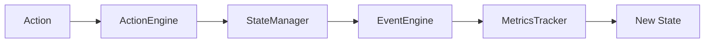
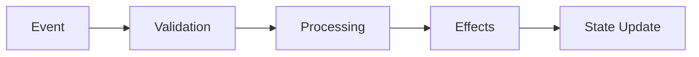

# 치킨마스터 시스템 아키텍처

## 1. 아키텍처 개요

### 1.1 설계 원칙
- 헥사고널 아키텍처 기반
- 도메인 주도 설계(DDD) 적용
- 불변 객체 패턴 사용
- 인터페이스 기반 설계

### 1.2 핵심 컴포넌트


## 2. 컴포넌트 상세

### 2.1 코어 도메인 (src/core/)
- GameState: 불변 게임 상태 관리
- GameSettings: 게임 설정 관리
- GameMetrics: 게임 지표 관리
- Interfaces: 도메인 인터페이스 정의

### 2.2 이벤트 시스템 (src/events/)
- EventEngine: 이벤트 처리 엔진
- EventModels: 이벤트 도메인 모델
- EventValidators: 이벤트 검증
- EventEffects: 이벤트 효과 처리

### 2.3 게임 루프 (src/game_loop/)
- AbstractGameLoop: 게임 루프 추상 클래스
- MUDGameLoop: 텍스트 기반 구현
- WebGameLoop: 웹 기반 구현
- StateManager: 상태 관리

### 2.4 액션 시스템 (src/actions/)
- ActionEngine: 액션 처리 엔진
- ActionModels: 액션 도메인 모델
- ActionValidators: 액션 검증
- ActionEffects: 액션 효과 처리

### 2.5 메트릭스 시스템 (src/metrics/)
- MetricsTracker: 지표 추적
- MetricsModels: 지표 도메인 모델
- MetricsValidators: 지표 검증
- MetricsEffects: 지표 효과 처리

## 3. 데이터 흐름

### 3.1 상태 관리


### 3.2 이벤트 처리


## 4. 인터페이스

### 4.1 코어 인터페이스
```python
class IGameState:
    """게임 상태 인터페이스"""
    pass

class IEventEngine:
    """이벤트 엔진 인터페이스"""
    pass

class IActionEngine:
    """액션 엔진 인터페이스"""
    pass

class IMetricsTracker:
    """지표 추적 인터페이스"""
    pass
```

## 5. 확장성

### 5.1 플러그인 시스템
- 이벤트 플러그인
- 액션 플러그인
- 지표 플러그인
- UI 플러그인

### 5.2 설정 관리
- 외부 설정 파일
- 환경 변수
- 실행 시 인자

## 6. 테스트 전략

### 6.1 테스트 수준
- 단위 테스트: 개별 컴포넌트
- 통합 테스트: 컴포넌트 간 상호작용
- 시스템 테스트: 전체 시스템
- 성능 테스트: 부하 및 성능

### 6.2 테스트 자동화
- CI/CD 파이프라인
- 자동 테스트 실행
- 테스트 보고서 생성

## 7. 배포 전략

### 7.1 배포 프로세스
- 개발 환경
- 스테이징 환경
- 프로덕션 환경

### 7.2 모니터링
- 로그 수집
- 메트릭스 모니터링
- 알림 시스템 