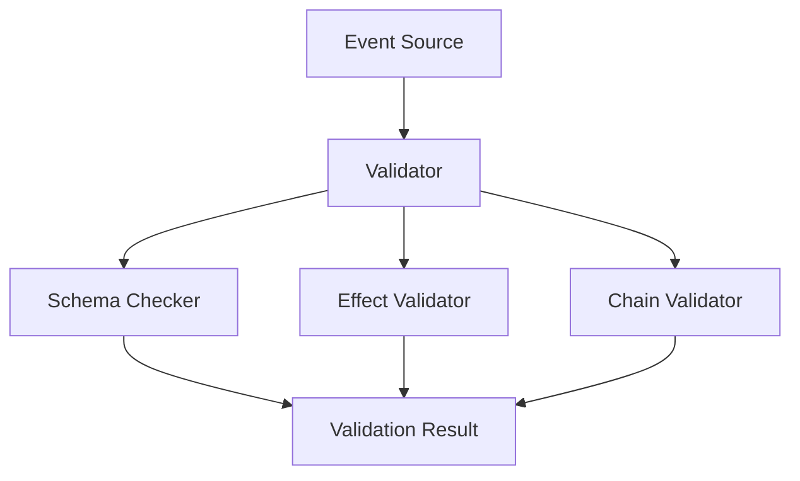

# 이벤트 검증기 설계

## 개요

이벤트 검증기는 게임 이벤트의 유효성을 검사하고 일관성을 유지하는 도구입니다. 이 도구는 이벤트 정의, 효과, 그리고 연쇄 작용의 정확성을 보장합니다.

## 아키텍처

### 핵심 컴포넌트



## 검증 규칙

### 1. 스키마 검증

```python
class SchemaValidator:
    def validate_event_schema(self, event: Dict) -> ValidationResult:
        """이벤트 스키마를 검증합니다."""
        required_fields = ['id', 'type', 'effects']
        optional_fields = ['trigger', 'probability']
        
        return self.check_fields(event, required_fields, optional_fields)
```

### 2. 효과 검증

```python
class EffectValidator:
    def validate_effects(self, effects: List[Effect]) -> ValidationResult:
        """이벤트 효과를 검증합니다."""
        for effect in effects:
            if not self.validate_single_effect(effect):
                return ValidationResult(False, f"Invalid effect: {effect}")
        return ValidationResult(True, "All effects valid")
```

### 3. 연쇄 검증

```python
class ChainValidator:
    def validate_chain(self, event_chain: List[Event]) -> ValidationResult:
        """이벤트 연쇄를 검증합니다."""
        if len(event_chain) > self.MAX_CHAIN_LENGTH:
            return ValidationResult(False, "Chain too long")
        
        return self.check_chain_validity(event_chain)
```

## 구현 세부사항

### 1. 검증기 클래스

```python
class EventValidator:
    def __init__(self):
        self.schema_validator = SchemaValidator()
        self.effect_validator = EffectValidator()
        self.chain_validator = ChainValidator()
    
    def validate(self, event: Event) -> ValidationResult:
        """이벤트의 모든 측면을 검증합니다."""
        schema_result = self.schema_validator.validate_event_schema(event)
        if not schema_result.is_valid:
            return schema_result
            
        effect_result = self.effect_validator.validate_effects(event.effects)
        if not effect_result.is_valid:
            return effect_result
            
        chain_result = self.chain_validator.validate_chain(event.chain)
        return chain_result
```

### 2. 검증 결과

```python
@dataclass
class ValidationResult:
    is_valid: bool
    message: str
    details: Optional[Dict] = None
```

### 3. 검증 규칙 정의

```python
class ValidationRules:
    # 이벤트 규칙
    MAX_CHAIN_LENGTH = 5
    MAX_EFFECTS_PER_EVENT = 10
    
    # 효과 규칙
    MIN_PROBABILITY = 0.0
    MAX_PROBABILITY = 1.0
    
    # 수치 규칙
    MIN_METRIC_CHANGE = -100.0
    MAX_METRIC_CHANGE = 100.0
```

## 사용 예시

### 1. 기본 검증

```python
def validate_event_example():
    validator = EventValidator()
    event = Event(
        id="customer_complaint",
        type=EventType.RANDOM,
        effects=[
            Effect(metric="reputation", value=-10)
        ]
    )
    
    result = validator.validate(event)
    assert result.is_valid
```

### 2. 연쇄 검증

```python
def validate_chain_example():
    validator = EventValidator()
    event_chain = [
        Event(id="initial_event", type=EventType.TRIGGER),
        Event(id="chain_event_1", type=EventType.CHAIN),
        Event(id="chain_event_2", type=EventType.CHAIN)
    ]
    
    result = validator.validate_chain(event_chain)
    assert result.is_valid
```

## 오류 처리

### 1. 검증 오류

```python
class ValidationError(Exception):
    def __init__(self, message: str, details: Dict = None):
        super().__init__(message)
        self.details = details
```

### 2. 오류 처리 예시

```python
try:
    result = validator.validate(event)
    if not result.is_valid:
        raise ValidationError(result.message, result.details)
except ValidationError as e:
    logger.error(f"Validation failed: {e.message}")
    logger.debug(f"Details: {e.details}")
```

## 확장성

### 1. 커스텀 검증 규칙

```python
class CustomValidator(EventValidator):
    def __init__(self, rules: Dict[str, Any]):
        super().__init__()
        self.custom_rules = rules
    
    def validate(self, event: Event) -> ValidationResult:
        base_result = super().validate(event)
        if not base_result.is_valid:
            return base_result
            
        return self.apply_custom_rules(event)
```

### 2. 플러그인 시스템

```python
class ValidatorPlugin:
    def __init__(self, name: str):
        self.name = name
    
    def validate(self, event: Event) -> ValidationResult:
        """플러그인 특화 검증을 수행합니다."""
        pass
```

## 성능 최적화

### 1. 캐싱

```python
class CachedValidator:
    def __init__(self):
        self.cache = {}
    
    def validate(self, event: Event) -> ValidationResult:
        cache_key = self.generate_cache_key(event)
        if cache_key in self.cache:
            return self.cache[cache_key]
            
        result = super().validate(event)
        self.cache[cache_key] = result
        return result
```

### 2. 병렬 처리

```python
class ParallelValidator:
    def validate_batch(self, events: List[Event]) -> List[ValidationResult]:
        """여러 이벤트를 병렬로 검증합니다."""
        with ThreadPoolExecutor() as executor:
            return list(executor.map(self.validate, events))
```

## 모니터링

### 1. 검증 메트릭

```python
class ValidationMetrics:
    def __init__(self):
        self.total_validations = 0
        self.failed_validations = 0
        self.validation_times = []
    
    def record_validation(self, result: ValidationResult, time_taken: float):
        """검증 결과를 기록합니다."""
        self.total_validations += 1
        if not result.is_valid:
            self.failed_validations += 1
        self.validation_times.append(time_taken)
```

### 2. 보고서 생성

```python
class ValidationReporter:
    def generate_report(self, metrics: ValidationMetrics) -> Report:
        """검증 메트릭 보고서를 생성합니다."""
        return Report(
            total=metrics.total_validations,
            failed=metrics.failed_validations,
            avg_time=statistics.mean(metrics.validation_times)
        )
```

## 테스트

### 1. 단위 테스트

```python
class TestEventValidator(unittest.TestCase):
    def setUp(self):
        self.validator = EventValidator()
    
    def test_valid_event(self):
        event = create_test_event()
        result = self.validator.validate(event)
        self.assertTrue(result.is_valid)
    
    def test_invalid_event(self):
        event = create_invalid_event()
        result = self.validator.validate(event)
        self.assertFalse(result.is_valid)
```

### 2. 통합 테스트

```python
class TestValidatorIntegration(unittest.TestCase):
    def test_full_validation_flow(self):
        """전체 검증 흐름을 테스트합니다."""
        event_chain = create_test_chain()
        validator = EventValidator()
        
        result = validator.validate(event_chain)
        self.assertTrue(result.is_valid)
        self.assertIsNotNone(result.details)
``` 