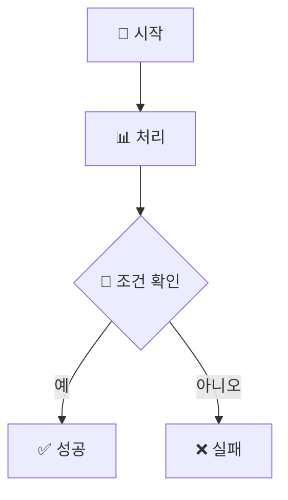

# 🎨 Chickenmaster 다이어그램 모음

이 폴더는 Chickenmaster 프로젝트의 모든 시각적 다이어그램을 관리합니다.

## 📊 다이어그램 목록

### 🏗️ 아키텍처 다이어그램
- [시스템 전체 구조도](./system_architecture.md) - 헥사고널 아키텍처 전체 구조
- [모듈 의존성 다이어그램](./module_dependencies.md) - 모듈 간 의존 관계
- [데이터 플로우](./data_flow.md) - 데이터 흐름 및 처리 과정

### 🎮 게임 플레이 다이어그램  
- [게임 플레이 순서도](./gameplay_flow.md) - 전체 게임 진행 흐름
- [트레이드오프 시스템](./tradeoff_system.md) - ⚖️ **핵심 메커니즘! 모든 선택이 딜레마**
- [이벤트 처리 플로우](./event_processing.md) - 이벤트 엔진 동작 과정

### 📊 데이터 관리 다이어그램
- [엑셀 기반 상수 관리](./excel_constants_system.md) - 동적 상수 관리 시스템
- [메트릭 추적 시스템](./metrics_tracking.md) - 지표 추적 및 변경 과정

### 🎨 가이드 문서
- [Mermaid 사용 가이드](./mermaid_guide.md) - Mermaid 다이어그램 작성법 및 도구 사용법

## 🔧 Mermaid 사용법

### 온라인 에디터
- [Mermaid Live Editor](https://mermaid.live/) - 실시간 편집 및 미리보기

### VS Code 확장
```bash
# Mermaid Preview 확장 설치
code --install-extension bierner.markdown-mermaid
```

### 로컬 렌더링
```bash
# Mermaid CLI 설치
npm install -g @mermaid-js/mermaid-cli

# 다이어그램을 이미지로 변환
mmdc -i diagram.mmd -o diagram.png
```

## 📝 다이어그램 작성 가이드

### 스타일 가이드
- 이모지 사용으로 가독성 향상
- 색상 그룹핑으로 모듈별 구분
- 명확한 화살표와 레이블

### 예시 템플릿


## 🔄 업데이트 가이드

1. 새로운 기능 추가 시 관련 다이어그램 업데이트
2. 아키텍처 변경 시 해당 다이어그램 수정
3. 모든 다이어그램은 현재 코드와 동기화 유지

---

💡 **Tip**: GitHub에서 Mermaid 다이어그램은 자동으로 렌더링됩니다! 