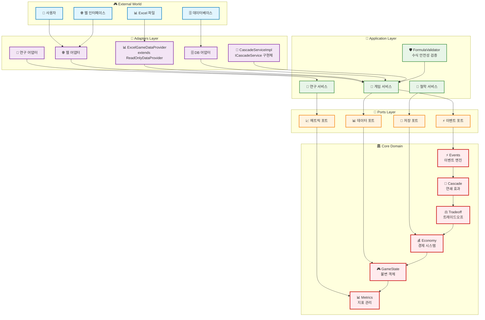
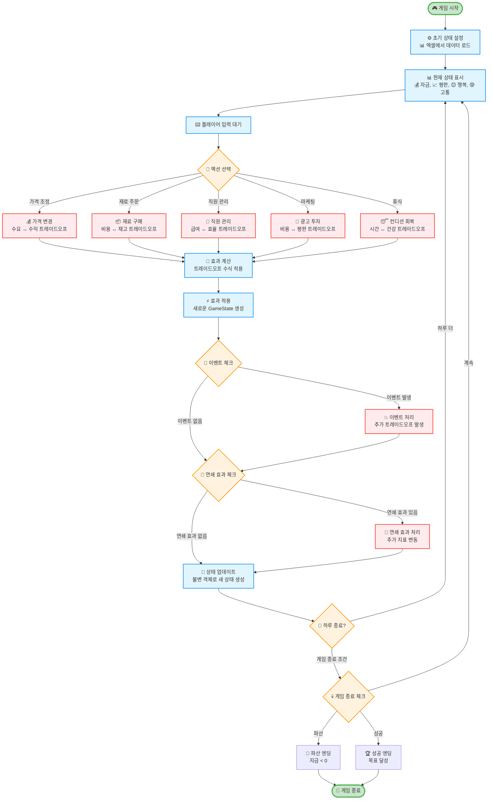
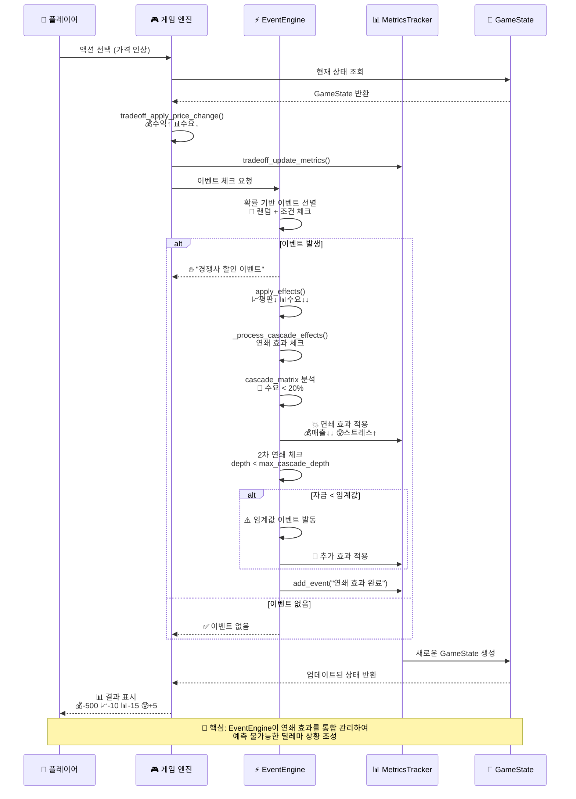

# 🎮 Chickenmaster 완전한 시스템 개요

이 문서는 Chickenmaster 프로젝트의 모든 핵심 시스템을 시각화한 종합 다이어그램 모음입니다.

## 📋 목차

1. [🏗️ 헥사고널 아키텍처 전체 구조](#1-헥사고널-아키텍처-전체-구조)
2. [🎮 게임 플레이 핵심 플로우](#2-게임-플레이-핵심-플로우)
3. [📊 엑셀 기반 동적 데이터 관리](#3-엑셀-기반-동적-데이터-관리)
4. [⚖️ 트레이드오프 시스템](#4-트레이드오프-시스템)
5. [🎲 이벤트 시스템과 연쇄 효과](#5-이벤트-시스템과-연쇄-효과)

---

## 1. 🏗️ 헥사고널 아키텍처 전체 구조

**목적**: 프로젝트의 전반적인 아키텍처와 모듈 간 의존성을 시각화



### 핵심 특징
- **의존성 역전**: 외부 시스템이 코어 도메인에 의존하지 않음
- **불변성**: 모든 도메인 객체는 불변 (frozen dataclass)
- **포트와 어댑터**: 명확한 인터페이스 분리

---

## 2. 🎮 게임 플레이 핵심 플로우

**목적**: 사용자가 게임을 플레이하는 전체 흐름과 의사결정 과정을 시각화



### 핵심 게임 메커니즘
- **모든 선택은 트레이드오프**: 하나의 지표 상승은 다른 지표 하락을 의미
- **예측 불가능성**: 이벤트와 연쇄 효과로 완전한 예측 불가
- **불변 상태 관리**: 모든 상태 변경은 새로운 객체 생성

---

## 3. 📊 엑셀 기반 동적 데이터 관리

**목적**: 게임 밸런싱을 위한 동적 상수 관리 시스템 구조

```mermaid
graph TD
    subgraph "📊 Excel 파일 구조"
        EXCEL[📋 game_initial_values.xlsx]
        METRICS_SHEET[📈 Game_Metrics<br/>기본 지표 값]
        CONSTANTS_SHEET[🔢 Game_Constants<br/>게임 상수]
        TRADEOFF_SHEET[⚖️ Tradeoff_Relationships<br/>트레이드오프 관계]
        FORMULA_SHEET[🧮 Formula_Examples<br/>수식 예제]
        VARIABLE_SHEET[🔗 Variable_Reference<br/>변수 참조]
    end
    
    subgraph "🔄 데이터 처리 파이프라인"
        LOADER[📥 ExcelGameDataProvider<br/>엑셀 파일 로더]
        REGISTRY[🗂️ VariableRegistry<br/>• 변수 레지스트리<br/>• substitute_template()<br/>• evaluate_formula()]
        VALIDATOR[🛡️ FormulaValidator<br/>수식 안전성 검증]
    end
    
    subgraph "🎮 게임 시스템"
        INITIALIZER[⚙️ GameInitializer<br/>게임 초기화]
        STATE[🎯 GameState<br/>게임 상태]
        CONSTANTS[🔢 게임 상수<br/>동적 로딩]
    end
    
    subgraph "🧮 VariableRegistry 내부 처리"
        TEMPLATE[📝 substitute_template()<br/>{변수명} → 실제값]
        SAFE_EVAL[🛡️ evaluate_formula()<br/>수학 연산만 허용]
        RESULT[✅ 계산 결과<br/>동적 값 생성]
    end
    
    %% 데이터 흐름
    EXCEL --> LOADER
    METRICS_SHEET --> LOADER
    CONSTANTS_SHEET --> LOADER
    TRADEOFF_SHEET --> LOADER
    FORMULA_SHEET --> LOADER
    VARIABLE_SHEET --> LOADER
    
    LOADER --> REGISTRY
    REGISTRY --> VALIDATOR
    VALIDATOR --> REGISTRY
    
    REGISTRY --> TEMPLATE
    TEMPLATE --> SAFE_EVAL
    SAFE_EVAL --> RESULT
    
    RESULT --> INITIALIZER
    INITIALIZER --> STATE
    RESULT --> CONSTANTS
    
    %% 순환 참조 (동적 업데이트)
    STATE -.->|상태 변경시| REGISTRY
    REGISTRY -.->|재계산| TEMPLATE
    
    %% 예제 수식 플로우
    FORMULA_EXAMPLE[💡 예제:<br/>starting_money = {DEFAULT_STARTING_MONEY} * 0.1]
    FORMULA_EXAMPLE --> TEMPLATE
    
    classDef excel fill:#e8f5e8,stroke:#4caf50,stroke-width:2px
    classDef processor fill:#e3f2fd,stroke:#2196f3,stroke-width:2px
    classDef game fill:#fff3e0,stroke:#ff9800,stroke-width:2px
    classDef formula fill:#fce4ec,stroke:#e91e63,stroke-width:2px
    classDef example fill:#f3e5f5,stroke:#9c27b0,stroke-width:2px
    
    class EXCEL,METRICS_SHEET,CONSTANTS_SHEET,TRADEOFF_SHEET,FORMULA_SHEET,VARIABLE_SHEET excel
    class LOADER,REGISTRY,VALIDATOR processor
    class INITIALIZER,STATE,CONSTANTS game
    class TEMPLATE,SAFE_EVAL,RESULT formula
    class FORMULA_EXAMPLE example
```

### 주요 기능
- **통합 수식 처리**: VariableRegistry가 수식 파싱, 템플릿 치환, 평가를 모두 담당
- **변수 참조 시스템**: `{변수명}` 형태로 다른 모듈 값 참조
- **안전한 수식 평가**: eval() 함수를 제한된 환경에서 안전하게 실행
- **실시간 밸런싱**: 엑셀 파일 수정만으로 게임 밸런스 조정

---

## 4. ⚖️ 트레이드오프 시스템

**목적**: 게임의 핵심 메커니즘인 트레이드오프 관계를 시각화

```mermaid
graph TD
    subgraph "🎯 플레이어 액션"
        PRICE_UP[💰 가격 인상]
        PRICE_DOWN[💸 가격 할인]
        HIRE[👥 직원 고용]
        FIRE[✂️ 직원 해고]
        MARKETING[📢 마케팅 투자]
        REST[😴 휴식]
        EXPAND[🏗️ 시설 확장]
    end
    
    subgraph "⚖️ 트레이드오프 함수들"
        PRICE_TRADE[🔧 tradeoff_apply_price_change()]
        APPLY_TRADE[🔧 apply_tradeoff()]
        CAP_METRIC[🔧 cap_metric_value()]
        COMPUTE_DEMAND[🔧 tradeoff_compute_demand()]
    end
    
    subgraph "📊 게임 지표"
        MONEY[💰 자금]
        REPUTATION[📈 평판]
        HAPPINESS[😊 행복도]
        PAIN[😰 고통도]
        DEMAND[📊 수요]
        INVENTORY[📦 재고]
        FATIGUE[😴 피로도]
    end
    
    subgraph "🔄 EventEngine 연쇄 효과"
        EVENT_ENGINE[🎮 EventEngine<br/>• _process_cascade_effects()<br/>• cascade_matrix<br/>• max_cascade_depth]
        THRESHOLD[🚨 임계값 체크]
        CHAIN[⛓️ 연쇄 반응]
    end
    
    %% 긍정적 트레이드오프
    PRICE_UP -->|수익 증가| MONEY
    PRICE_UP -->|수요 감소| DEMAND
    DEMAND -->|매출 하락| MONEY
    
    HIRE -->|효율 증가| REPUTATION
    HIRE -->|급여 지출| MONEY
    
    MARKETING -->|평판 상승| REPUTATION
    MARKETING -->|비용 지출| MONEY
    REPUTATION -->|수요 증가| DEMAND
    
    %% 부정적 트레이드오프
    PRICE_DOWN -->|수요 증가| DEMAND
    PRICE_DOWN -->|수익 감소| MONEY
    
    FIRE -->|비용 절약| MONEY
    FIRE -->|서비스 하락| REPUTATION
    FIRE -->|스트레스 증가| PAIN
    
    REST -->|회복| HAPPINESS
    REST -->|기회비용| MONEY
    HAPPINESS -->|효율 증가| REPUTATION
    
    %% 복합적 트레이드오프
    EXPAND -->|용량 증가| INVENTORY
    EXPAND -->|대출 필요| MONEY
    EXPAND -->|스트레스| PAIN
    INVENTORY -->|매출 기회| DEMAND
    
    %% 트레이드오프 함수 처리
    PRICE_UP --> PRICE_TRADE
    PRICE_DOWN --> PRICE_TRADE
    HIRE --> APPLY_TRADE
    FIRE --> APPLY_TRADE
    MARKETING --> APPLY_TRADE
    REST --> APPLY_TRADE
    EXPAND --> APPLY_TRADE
    
    PRICE_TRADE --> CAP_METRIC
    APPLY_TRADE --> CAP_METRIC
    CAP_METRIC --> COMPUTE_DEMAND
    
    MONEY --> EVENT_ENGINE
    REPUTATION --> EVENT_ENGINE
    HAPPINESS --> EVENT_ENGINE
    PAIN --> EVENT_ENGINE
    DEMAND --> EVENT_ENGINE
    INVENTORY --> EVENT_ENGINE
    FATIGUE --> EVENT_ENGINE
    
    %% 연쇄 효과 (EventEngine 내부)
    EVENT_ENGINE --> THRESHOLD
    THRESHOLD -->|임계값 초과| CHAIN
    CHAIN -->|추가 변동| MONEY
    CHAIN -->|추가 변동| REPUTATION
    CHAIN -->|추가 변동| HAPPINESS
    
    %% 특별한 상황들
    BANKRUPTCY{💸 파산 위험<br/>자금 < 0}
    OVERWORK{😵 과로 위험<br/>피로도 > 80}
    SUCCESS{🏆 성공 조건<br/>모든 지표 균형}
    
    MONEY -->|임계값 체크| BANKRUPTCY
    FATIGUE -->|임계값 체크| OVERWORK
    COMPUTE_DEMAND -->|균형 체크| SUCCESS
    
    classDef action fill:#e3f2fd,stroke:#2196f3,stroke-width:2px
    classDef function fill:#f3e5f5,stroke:#9c27b0,stroke-width:3px
    classDef metric fill:#e8f5e8,stroke:#4caf50,stroke-width:2px
    classDef cascade fill:#fff3e0,stroke:#ff9800,stroke-width:2px
    classDef danger fill:#ffebee,stroke:#f44336,stroke-width:3px
    
    class PRICE_UP,PRICE_DOWN,HIRE,FIRE,MARKETING,REST,EXPAND action
    class PRICE_TRADE,APPLY_TRADE,CAP_METRIC,COMPUTE_DEMAND function
    class MONEY,REPUTATION,HAPPINESS,PAIN,DEMAND,INVENTORY,FATIGUE metric
    class EVENT_ENGINE,THRESHOLD,CHAIN cascade
    class BANKRUPTCY,OVERWORK,SUCCESS danger
```

### 트레이드오프 철학
- **정답 없음**: 모든 선택에는 득과 실이 존재
- **함수형 접근**: 객체가 아닌 순수 함수로 트레이드오프 처리
- **균형의 딜레마**: 완벽한 상태는 존재하지 않음
- **예측 불가능성**: EventEngine의 연쇄 효과로 인한 복잡한 상호작용

---

## 5. 🎲 이벤트 시스템과 연쇄 효과

**목적**: 이벤트 발생과 연쇄 효과의 처리 과정을 시퀀스로 시각화



### 이벤트 시스템 특징
- **통합 관리**: EventEngine이 이벤트 발생부터 연쇄 효과까지 모두 처리
- **확률적 발생**: 랜덤 요소와 조건부 트리거
- **다층 연쇄**: _process_cascade_effects()로 깊이 제한된 연쇄 처리
- **DAG 안전성**: is_dag_safe()로 순환 참조 방지
- **긴급 상황**: cascade_matrix 기반 임계값 이벤트 발생

---

## 💡 시스템 통합 인사이트

### 🏗️ 아키텍처 설계 철학
1. **헥사고널 아키텍처**: 외부 의존성으로부터 비즈니스 로직 보호
2. **불변성**: 모든 상태 객체는 불변하여 예측 가능한 동작 보장
3. **의존성 역전**: 포트와 어댑터 패턴으로 유연한 확장성

### 🎮 게임 디자인 철학
1. **딜레마 중심**: 모든 결정이 트레이드오프를 수반
2. **예측 불가능성**: 이벤트와 연쇄 효과로 완전한 예측 방지
3. **균형의 부재**: 완벽한 상태는 존재하지 않음

### 🔧 기술적 혁신
1. **엑셀 기반 밸런싱**: 비개발자도 게임 밸런스 조정 가능
2. **통합 수식 처리**: VariableRegistry가 파싱, 치환, 평가를 모두 담당
3. **함수형 트레이드오프**: 순수 함수로 예측 가능한 트레이드오프 처리
4. **EventEngine 통합 관리**: 이벤트부터 연쇄 효과까지 단일 엔진에서 처리

---

**🎯 이 시스템은 단순한 경영 시뮬레이션을 넘어서, 인생의 딜레마와 선택의 무게를 게임으로 구현한 철학적 작품입니다!** 🎯 