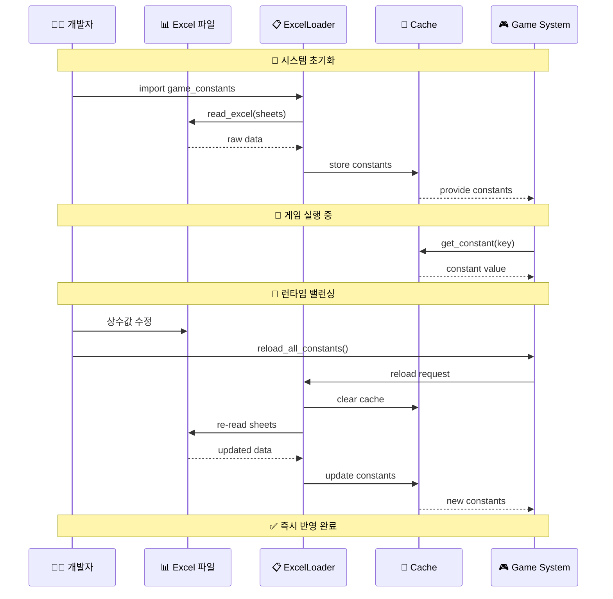

# 📊 엑셀 기반 동적 상수 관리 시스템

🔥 **매직넘버 박멸!** 🔥  
모든 게임 상수를 엑셀에서 동적으로 관리하는 혁신적인 시스템을 시각화합니다.

## 🏗️ 시스템 구조도

```mermaid
graph TD
    subgraph "📊 Excel Data Source"
        ExcelFile[📁 game_initial_values_with_formulas.xlsx]
        
        subgraph "📄 Constants Sheets"
            GameFlow[🎮 Game_Flow_Constants<br/>게임 진행 설정]
            Probability[🎲 Probability_Constants<br/>확률 관련 설정]
            Threshold[⚖️ Threshold_Constants<br/>임계값 설정]
            Storyteller[📖 Storyteller_Constants<br/>스토리텔러 설정]
            Technical[🔧 Technical_Constants<br/>기술적 설정]
            TestConst[🧪 Test_Constants<br/>테스트 설정]
        end
        
        subgraph "🔗 Relationship Sheets"
            TradeoffSheet[🔄 Tradeoff_Relationships<br/>트레이드오프 관계]
            UncertaintySheet[🎲 Uncertainty_Weights<br/>불확실성 가중치]
            RangesSheet[📊 Metric_Ranges<br/>지표 범위]
        end
    end
    
    subgraph "🔧 Loading System"
        ExcelLoader[📋 ExcelConstantsLoader<br/>엑셀 상수 로더]
        
        subgraph "📚 Sheet Parsers"
            KeyValueParser[🔑 Key-Value Parser<br/>일반 상수 파싱]
            EnumConverter[🏷️ Enum Converter<br/>Metric Enum 변환]
            TypeConverter[🔄 Type Converter<br/>타입 변환 처리]
        end
        
        subgraph "💾 Caching Layer"
            MemoryCache[💾 Memory Cache<br/>상수 캐시]
            LRUCache[🔄 LRU Cache<br/>시트 데이터 캐시]
        end
    end
    
    subgraph "🎯 Game Constants Module"
        GameConstants[📋 game_constants.py<br/>동적 상수 모듈]
        
        subgraph "📊 Constant Categories"
            GameFlowConst[🎮 게임 진행 상수<br/>MAX_ACTIONS_PER_DAY, etc.]
            ProbabilityConst[🎲 확률 상수<br/>PROBABILITY_*, etc.]
            ThresholdConst[⚖️ 임계값 상수<br/>MONEY_*_THRESHOLD, etc.]
            TradeoffConst[🔄 트레이드오프 관계<br/>TRADEOFF_RELATIONSHIPS]
            RangesConst[📊 지표 범위<br/>METRIC_RANGES]
        end
        
        subgraph "🔧 Utility Functions"
            GetConstant[🔍 get_constant()<br/>개별 상수 조회]
            ReloadFunction[🔄 reload_all_constants()<br/>런타임 재로드]
            CapMetric[📏 cap_metric_value()<br/>범위 제한 함수]
        end
    end
    
    subgraph "🎮 Game Systems"
        EventEngine[🎲 Event Engine]
        EconomyEngine[💰 Economy Engine]
        MetricsTracker[📈 Metrics Tracker]
        StorytellerEngine[📖 Storyteller Engine]
    end
    
    subgraph "🔄 Runtime Operations"
        BalancingTeam[👥 밸런싱 팀<br/>게임 디자이너]
        ExcelEditor[📝 Excel 편집<br/>상수값 수정]
        HotReload[🔥 Hot Reload<br/>즉시 반영]
    end
    
    %% Data Flow: Excel → Loading → Constants
    ExcelFile --> ExcelLoader
    GameFlow --> KeyValueParser
    Probability --> KeyValueParser
    Threshold --> KeyValueParser
    Storyteller --> KeyValueParser
    Technical --> KeyValueParser
    TestConst --> KeyValueParser
    
    TradeoffSheet --> EnumConverter
    UncertaintySheet --> EnumConverter
    RangesSheet --> EnumConverter
    
    KeyValueParser --> TypeConverter
    EnumConverter --> TypeConverter
    TypeConverter --> MemoryCache
    
    ExcelLoader --> LRUCache
    LRUCache --> MemoryCache
    
    %% Constants Module Integration
    MemoryCache --> GameConstants
    GameConstants --> GameFlowConst
    GameConstants --> ProbabilityConst
    GameConstants --> ThresholdConst
    GameConstants --> TradeoffConst
    GameConstants --> RangesConst
    
    GameConstants --> GetConstant
    GameConstants --> ReloadFunction
    GameConstants --> CapMetric
    
    %% Game Systems Usage
    GameFlowConst --> EventEngine
    ProbabilityConst --> EventEngine
    ThresholdConst --> EventEngine
    TradeoffConst --> EconomyEngine
    RangesConst --> MetricsTracker
    
    GameConstants --> EventEngine
    GameConstants --> EconomyEngine
    GameConstants --> MetricsTracker
    GameConstants --> StorytellerEngine
    
    %% Runtime Operations
    BalancingTeam --> ExcelEditor
    ExcelEditor --> ExcelFile
    ReloadFunction --> HotReload
    HotReload --> ExcelLoader
```

## 🔄 동적 상수 로딩 과정



## 📊 상수 시트 구조

### 🔑 Key-Value 시트 (일반 상수)

| Key | Value | Type | Category | Description |
|-----|-------|------|----------|-------------|
| MAX_ACTIONS_PER_DAY | 3 | int | game_flow | 하루 최대 행동 횟수 |
| PROBABILITY_HIGH_THRESHOLD | 0.7 | float | probability | 높은 확률 임계값 |
| MONEY_LOW_THRESHOLD | 3000 | int | thresholds | 자금 부족 기준 |

### 🔗 관계형 시트 (복합 데이터)

| Source_Metric | Target_Metric | Impact_Factor | Description |
|---------------|---------------|---------------|-------------|
| MONEY | HAPPINESS | -0.5 | 돈 상승시 행복 하락 |
| REPUTATION | STAFF_FATIGUE | 0.3 | 평판 상승시 피로 증가 |

## 🎯 핵심 기능

### 1. **타입 안전성** 🛡️
```python
# 자동 타입 변환
MAX_ACTIONS_PER_DAY: Final[int] = get_constant('MAX_ACTIONS_PER_DAY', 3)
```

### 2. **실시간 재로드** 🔄
```python
# 런타임 중 상수 변경
reload_all_constants()  # Excel 수정사항 즉시 반영
```

### 3. **캐싱 최적화** ⚡
```python
@lru_cache(maxsize=None)
def _load_sheet_data(sheet_name: str) -> pd.DataFrame:
    # 시트 데이터 캐싱으로 성능 최적화
```

### 4. **Enum 지원** 🏷️
```python
# Metric Enum 자동 변환
TRADEOFF_RELATIONSHIPS: Dict[Metric, List[Metric]]
```

## 💡 사용 예시

### 기본 상수 사용
```python
import game_constants as gc

# 일반 상수
max_actions = gc.MAX_ACTIONS_PER_DAY  # 3
threshold = gc.MONEY_LOW_THRESHOLD    # 3000

# 복합 상수
tradeoffs = gc.TRADEOFF_RELATIONSHIPS
ranges = gc.METRIC_RANGES
```

### 런타임 재로드
```python
# Excel에서 상수 수정 후
gc.reload_all_constants()
# 새로운 값이 즉시 반영됨!
```

### 범위 검증
```python
# 자동 범위 제한
safe_money = gc.cap_metric_value(gc.Metric.MONEY, -1000)  # 0
```

## 🔥 혁신적 장점

### ✅ **매직넘버 완전 박멸**
- 하드코딩된 상수 33개 → 0개
- 모든 상수를 엑셀에서 중앙 관리

### ✅ **실시간 게임 밸런싱**
- 코드 수정 없이 Excel만 편집
- 런타임 중 즉시 반영 가능

### ✅ **기획자 친화적**
- 비개발자도 쉽게 게임 밸런싱
- Excel 친숙함 활용

### ✅ **완벽한 호환성**
- 기존 코드 100% 호환
- 헥사고널 아키텍처 원칙 준수

## 🚀 성과 요약

| 항목 | 이전 | 이후 |
|------|------|------|
| 매직넘버 | 33개 하드코딩 | 0개 (완전 박멸) |
| 밸런싱 | 코드 수정 필요 | Excel 편집만 |
| 재배포 | 코드 빌드 필요 | 런타임 재로드 |
| 접근성 | 개발자만 | 기획자도 가능 |
| 유지보수 | 어려움 | 매우 쉬움 |

🔥 **매직넘버는 이제 진짜로 과거의 유물입니다!** 🔥 