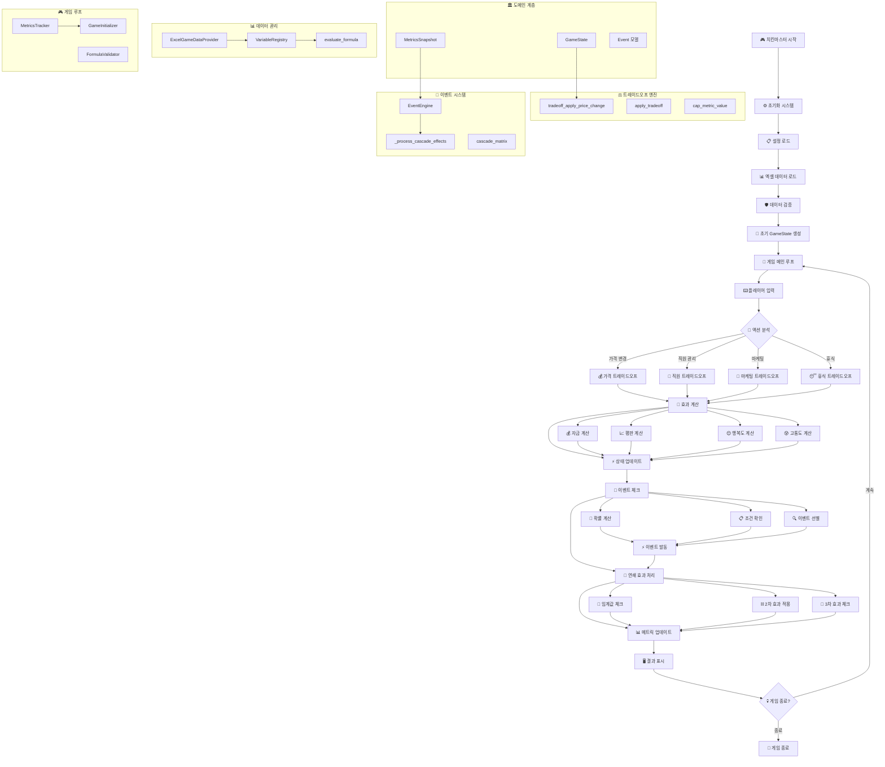
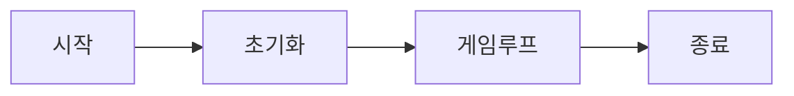
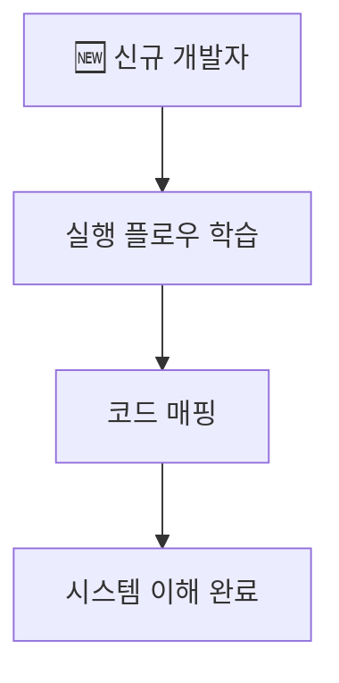
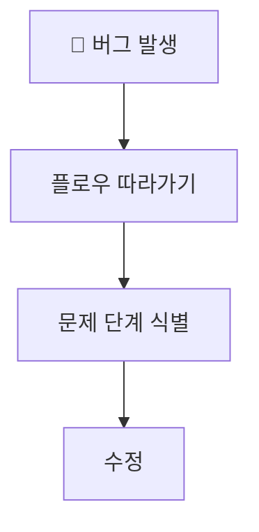
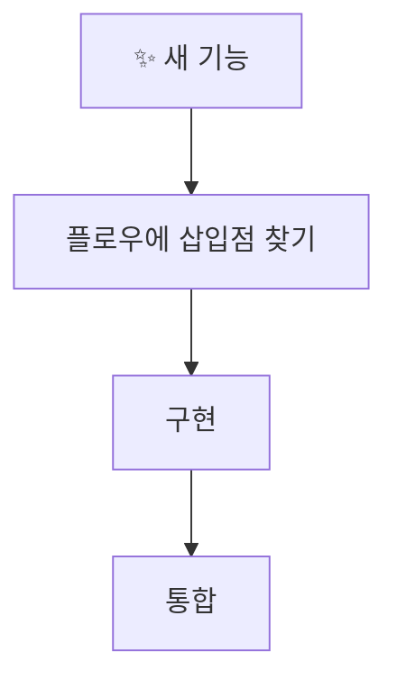

# 🚀 실행 가능한 플로우 다이어그램

이 문서는 **실제로 실행되는 순서**를 중심으로 한 새로운 다이어그램 스타일을 제시합니다.

## 🎯 새로운 접근법의 특징

- **구체적 실행 플로우**: 추상적 개념보다 실제 실행 순서
- **액션 중심**: 플레이어 액션부터 결과까지 전체 흐름
- **모듈 구조화**: subgraph로 관련 기능들 그룹화
- **디버깅 친화적**: 문제 발생 지점 쉽게 추적

---

## 🎮 치킨마스터 실행 플로우



---

## 🎯 이 스타일의 장점

### 1. **실행 순서 명확**

➡️ **코드 실행 순서와 정확히 일치**

### 2. **디버깅 친화적**
각 단계별로 어디서 문제가 생겼는지 쉽게 추적 가능:
- 🛡️ 데이터 검증 단계
- 🧮 효과 계산 단계  
- ⚡ 상태 업데이트 단계
- 🌊 연쇄 효과 단계

### 3. **개발자 온보딩 최적화**
신규 개발자가 시스템을 이해하는 순서:
1. 전체 플로우 파악
2. 세부 모듈 이해
3. 코드 매핑

### 4. **테스트 케이스 설계**
각 단계별로 테스트 케이스 설계 가능:
```python
def test_price_tradeoff_flow():
    # 1. 가격 변경 액션
    # 2. 트레이드오프 계산
    # 3. 상태 업데이트 
    # 4. 연쇄 효과 체크
```

---

## 📊 기존 vs 새로운 스타일 비교

| 특징 | 기존 스타일 | 새로운 스타일 |
|------|-------------|---------------|
| **목적** | 아키텍처 이해 | 실행 플로우 이해 |
| **관점** | 구조적 (What) | 절차적 (How) |
| **활용** | 설계 문서 | 개발/디버깅 가이드 |
| **대상** | 아키텍트 | 개발자 |
| **장점** | 전체 구조 파악 | 구체적 구현 가이드 |

---

## 🚀 활용 가능한 시나리오

### 1. **신규 개발자 온보딩**


### 2. **버그 디버깅**


### 3. **기능 추가**


---

## 💡 결론

**두 스타일 모두 필요합니다!**

- **구조적 다이어그램**: 전체 아키텍처 이해용
- **실행 플로우 다이어그램**: 개발/운영용

이렇게 **상호 보완적으로** 사용할 때 최대 효과를 발휘합니다! 🎯 