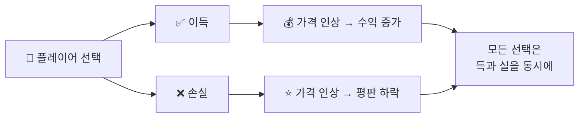
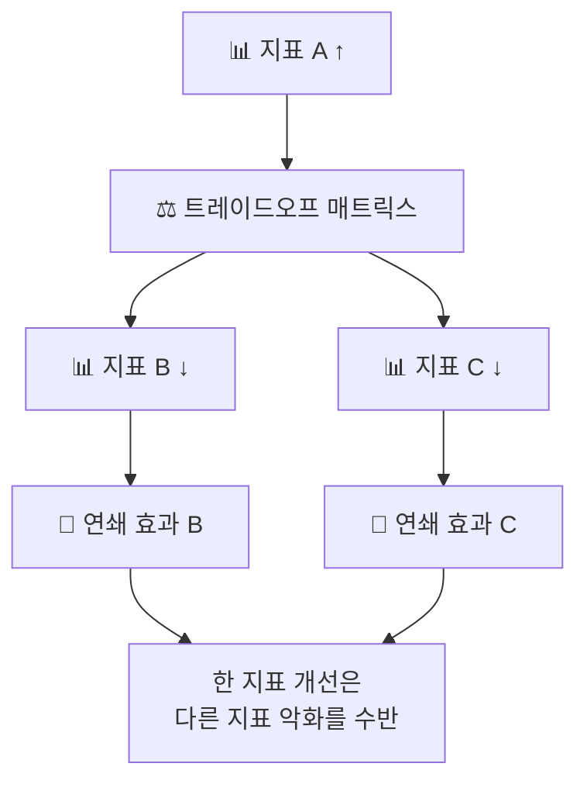
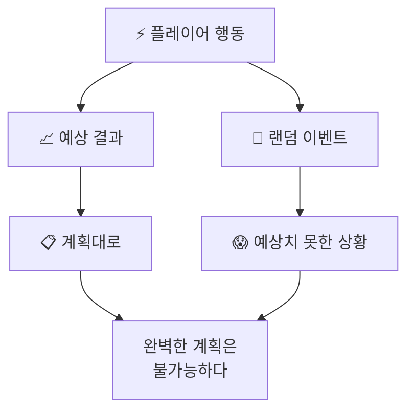
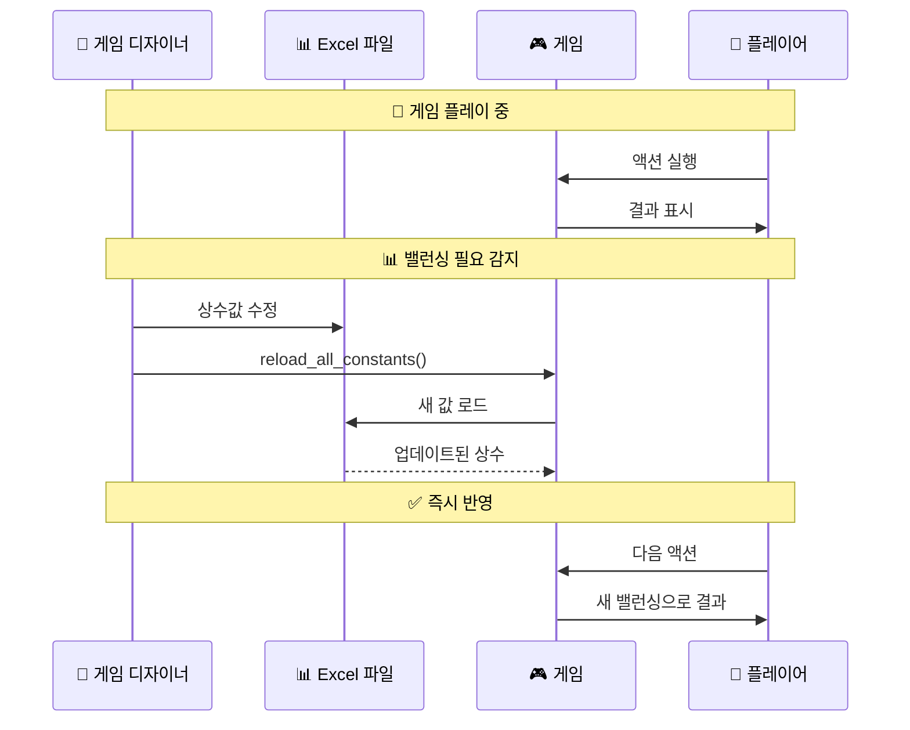

# 🎮 게임 플레이 순서도

Chickenmaster의 전체 게임 플레이 흐름을 시각화합니다.

## 🔄 메인 게임 루프

```mermaid
graph TD
    Start([👋 게임 시작]) --> LoadExcel[📊 엑셀 상수 로드]
    LoadExcel --> InitGame[🔧 게임 시스템 초기화]
    
    InitGame --> CreateGameState[🎯 GameState 생성]
    CreateGameState --> CreateMetrics[📊 MetricsSnapshot 생성]
    
    CreateGameState --> GameLoop{🔄 게임 루프}
    CreateMetrics --> GameLoop
    
    GameLoop --> DisplayStatus[🖥️ 현재 상태 표시]
    DisplayStatus --> ShowMetrics[📊 지표 현황<br/>💰돈, ⭐평판, 😊행복, 😰고통<br/>📦재고, 😴피로, 🏭시설, 📈수요]
    
    ShowMetrics --> ShowEvents[📰 최근 이벤트 표시]
    ShowEvents --> ShowActions[🎯 선택 가능한 행동]
    
    ShowActions --> PlayerInput[⌨️ 플레이어 입력 대기]
    
    PlayerInput --> ActionValidation{✅ 입력 검증}
    ActionValidation --> |유효하지 않음| ShowActions
    
    ActionValidation --> |유효함| ProcessAction[⚡ 액션 처리]
    
    ProcessAction --> PriceChange{💰 가격 변경?}
    ProcessAction --> OrderInventory{📦 재료 주문?}
    ProcessAction --> ManageStaff{👥 직원 관리?}
    ProcessAction --> Promotion{📢 홍보 활동?}
    ProcessAction --> FacilityUpgrade{🏭 시설 개선?}
    ProcessAction --> PersonalRest{😴 개인 휴식?}
    ProcessAction --> Research{🧪 연구개발?}
    
    PriceChange --> |예| PriceAction[💰 가격 조정<br/>평판 -2, 수요 ±5]
    OrderInventory --> |예| InventoryAction[📦 재료 구매<br/>돈 -50000, 재고 +50]
    ManageStaff --> |예| StaffAction[👥 직원 케어<br/>돈 -30000, 행복 +10, 피로 -20]
    Promotion --> |예| PromoAction[📢 광고 실행<br/>돈 -20000, 평판 +15, 수요 +10]
    FacilityUpgrade --> |예| FacilityAction[🏭 시설 개선<br/>돈 -100000, 평판 +10, 시설 +20]
    PersonalRest --> |예| RestAction[😴 컨디션 회복<br/>행복 +20, 고통 -15, 돈 -10000]
    Research --> |예| RnDAction[🧪 혁신 연구<br/>돈 -80000, 성공시 혁신 효과]
    
    PriceAction --> ApplyEffects[⚡ 효과 적용]
    InventoryAction --> ApplyEffects
    StaffAction --> ApplyEffects
    PromoAction --> ApplyEffects
    FacilityAction --> ApplyEffects
    RestAction --> ApplyEffects
    RnDAction --> ApplyEffects
    
    ApplyEffects --> UpdateGameState[🔄 GameState 업데이트]
    UpdateGameState --> UpdateMetrics[📊 MetricsSnapshot 업데이트]
    
    UpdateMetrics --> EventPolling[🔍 이벤트 폴링]
    
    EventPolling --> ThresholdEvents{📊 임계값 이벤트?}
    EventPolling --> RandomEvents{🎲 랜덤 이벤트?}
    
    ThresholdEvents --> |발생| TriggerThreshold[⚠️ 임계값 이벤트 발생]
    RandomEvents --> |발생| TriggerRandom[🎲 랜덤 이벤트 발생]
    
    TriggerThreshold --> EventQueue[📋 이벤트 큐]
    TriggerRandom --> EventQueue
    
    EventQueue --> ProcessEvents[⚡ 이벤트 처리]
    ProcessEvents --> EventEffects[💥 이벤트 효과 적용]
    
    EventEffects --> TradeoffEngine[⚖️ 트레이드오프 엔진]
    TradeoffEngine --> ApplyTradeoffs[🔄 트레이드오프 적용<br/>한 지표 ↑ → 다른 지표 ↓]
    
    ApplyTradeoffs --> CascadeEngine[🌊 연쇄 효과 엔진]
    CascadeEngine --> ProcessCascade[🔗 연쇄 효과 처리]
    
    ProcessCascade --> CycleCheck{🔄 순환 참조?}
    CycleCheck --> |안전| ApplyCascade[✅ 연쇄 효과 적용]
    CycleCheck --> |위험| StopCascade[🛑 연쇄 중단]
    
    ApplyCascade --> EconomyCalc[💰 경제 계산]
    StopCascade --> EconomyCalc
    
    EconomyCalc --> DailyBusiness[🏪 일일 비즈니스 시뮬레이션]
    DailyBusiness --> CustomerCalc[👥 고객 수 계산<br/>수요 + 랜덤 ± 평판]
    CustomerCalc --> RevenueCalc[💰 매출 계산<br/>고객 × 가격 × 재고 제한]
    
    RevenueCalc --> StoryGeneration[📖 스토리 생성]
    StoryGeneration --> AnalyzeContext[📚 컨텍스트 분석<br/>지표 변화 + 이벤트 내역]
    AnalyzeContext --> GenerateNarrative[✍️ 서사 생성<br/>트레이드오프 철학 반영]
    
    GenerateNarrative --> FinalUpdate[🔄 최종 상태 업데이트]
    FinalUpdate --> SavePreviousState[💾 이전 상태 저장<br/>변화량 계산용]
    
    SavePreviousState --> CheckGameOver{💀 게임 종료 조건?}
    
    CheckGameOver --> |파산| GameOver[💀 게임 종료<br/>최종 결과 표시]
    CheckGameOver --> |계속| NextTurn[➡️ 다음 턴]
    
    NextTurn --> IncrementDay[📅 날짜 증가]
    IncrementDay --> GameLoop
    
    GameOver --> ShowResults[📊 최종 결과<br/>생존 일수, 최종 지표]
    ShowResults --> RestartPrompt{🔄 재시작?}
    
    RestartPrompt --> |예| Start
    RestartPrompt --> |아니오| Exit([👋 게임 종료])
    
    %% 런타임 재로드 (언제든지 가능)
    GameLoop --> RuntimeReload{🔄 상수 재로드?}
    RuntimeReload --> |예| ReloadConstants[🔄 reload_all_constants]
    RuntimeReload --> |아니오| DisplayStatus
    ReloadConstants --> LoadExcel
    
    subgraph "🎯 플레이어 액션"
        PriceChange
        OrderInventory
        ManageStaff
        Promotion
        FacilityUpgrade
        PersonalRest
        Research
    end
    
    subgraph "⚡ 효과 처리"
        ApplyEffects
        UpdateGameState
        UpdateMetrics
    end
    
    subgraph "🎲 이벤트 시스템"
        EventPolling
        ThresholdEvents
        RandomEvents
        ProcessEvents
    end
    
    subgraph "⚖️ 트레이드오프 시스템"
        TradeoffEngine
        ApplyTradeoffs
        CascadeEngine
    end
    
    subgraph "💰 경제 시스템"
        EconomyCalc
        DailyBusiness
        CustomerCalc
        RevenueCalc
    end
    
    subgraph "📖 스토리 시스템"
        StoryGeneration
        AnalyzeContext
        GenerateNarrative
    end
```



## 🎲 이벤트 처리 상세 흐름

```mermaid
graph TD
    EventTrigger[⚡ 이벤트 트리거] --> EventType{🎲 이벤트 타입}
    
    EventType --> |THRESHOLD| ThresholdEvent[📊 임계값 이벤트<br/>지표가 특정 값에 도달]
    EventType --> |RANDOM| RandomEvent[🎰 랜덤 이벤트<br/>확률 기반 발생]
    EventType --> |CASCADE| CascadeEvent[🌊 연쇄 이벤트<br/>다른 이벤트의 부작용]
    
    ThresholdEvent --> CheckCondition[🔍 조건 확인<br/>MONEY < 3000?<br/>REPUTATION > 80?]
    RandomEvent --> CheckProbability[🎯 확률 확인<br/>random() < 0.3?]
    CascadeEvent --> CheckCascade[🔗 연쇄 조건 확인]
    
    CheckCondition --> |만족| AddToQueue[📋 이벤트 큐에 추가]
    CheckProbability --> |성공| AddToQueue
    CheckCascade --> |발생| AddToQueue
    
    AddToQueue --> ProcessQueue[⚡ 큐 처리]
    ProcessQueue --> ApplyEventEffects[💥 이벤트 효과 적용]
    
    ApplyEventEffects --> FormulaEval[🧮 수식 평가<br/>"money + 1000"<br/>"reputation * 0.9"<br/>"value * 1.2"]
    
    FormulaEval --> TradeoffCheck[⚖️ 트레이드오프 확인]
    TradeoffCheck --> |MONEY ↑| MoneyTradeoff[💰 → 😊 ↓ & 😴 ↑<br/>돈 증가시 행복 감소, 피로 증가]
    TradeoffCheck --> |REPUTATION ↑| ReputationTradeoff[⭐ → 💰 ↓ & 😴 ↑<br/>평판 증가시 돈 감소, 피로 증가]
    
    MoneyTradeoff --> CascadeTrigger[🌊 연쇄 효과 트리거]
    ReputationTradeoff --> CascadeTrigger
    
    CascadeTrigger --> CascadeDepthCheck{🔢 연쇄 깊이 체크}
    CascadeDepthCheck --> |< 5| ApplyCascadeEffect[✅ 연쇄 효과 적용]
    CascadeDepthCheck --> |>= 5| StopCascadeEffect[🛑 연쇄 중단<br/>무한 루프 방지]
    
    ApplyCascadeEffect --> EventComplete[✅ 이벤트 처리 완료]
    StopCascadeEffect --> EventComplete
```

## 🎯 게임 철학 구현

### 🚫 **정답 없음** (No Right Answer)


### ⚖️ **트레이드오프** (Trade-off)


### 🎲 **불확실성** (Uncertainty)


## 🔧 실시간 밸런싱



## 🎮 플레이어 경험

### 😊 **긍정적 피드백 루프**
- 성공적인 선택 → 지표 개선 → 더 많은 선택지
- 위험 감수 → 큰 보상 → 성취감

### 😰 **도전적 상황**
- 위기 상황 → 어려운 선택 → 트레이드오프 고민
- 예상치 못한 이벤트 → 적응 → 학습

### 🎯 **학습과 성장**
- 실패 → 분석 → 개선된 전략
- 패턴 인식 → 더 나은 판단 → 숙련도 향상

🎮 **"정답 없는 삶을 압축 체험"하는 게임!** 🎮 