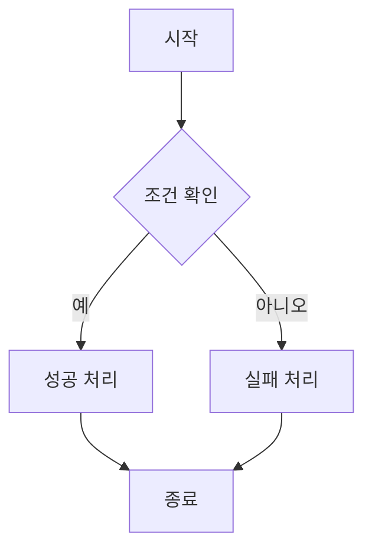
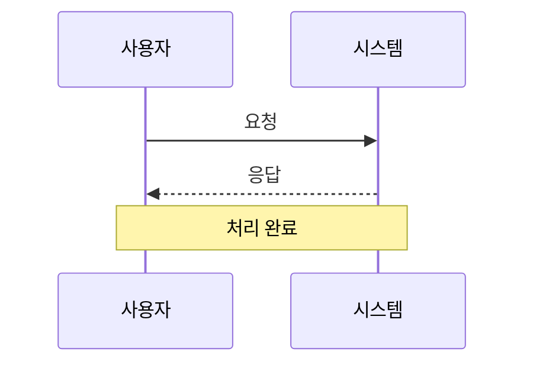
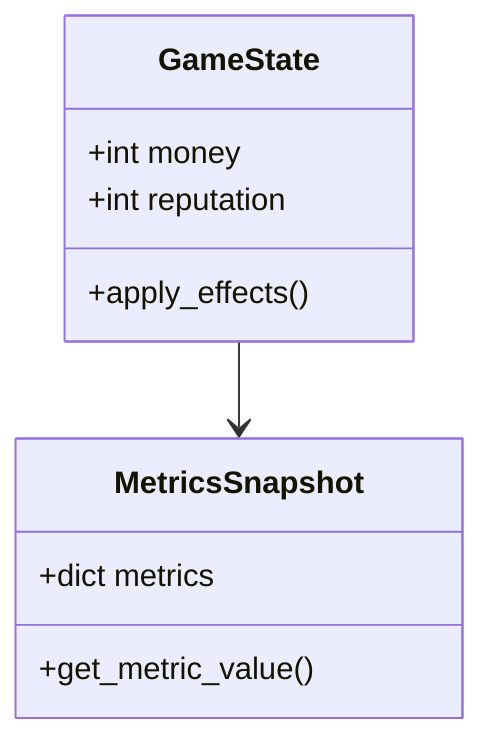
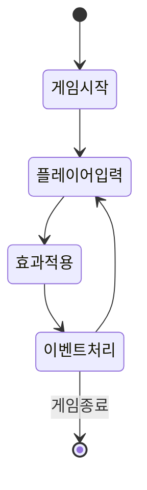
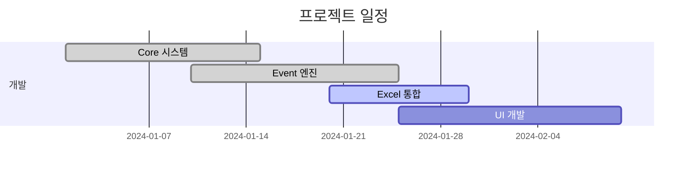
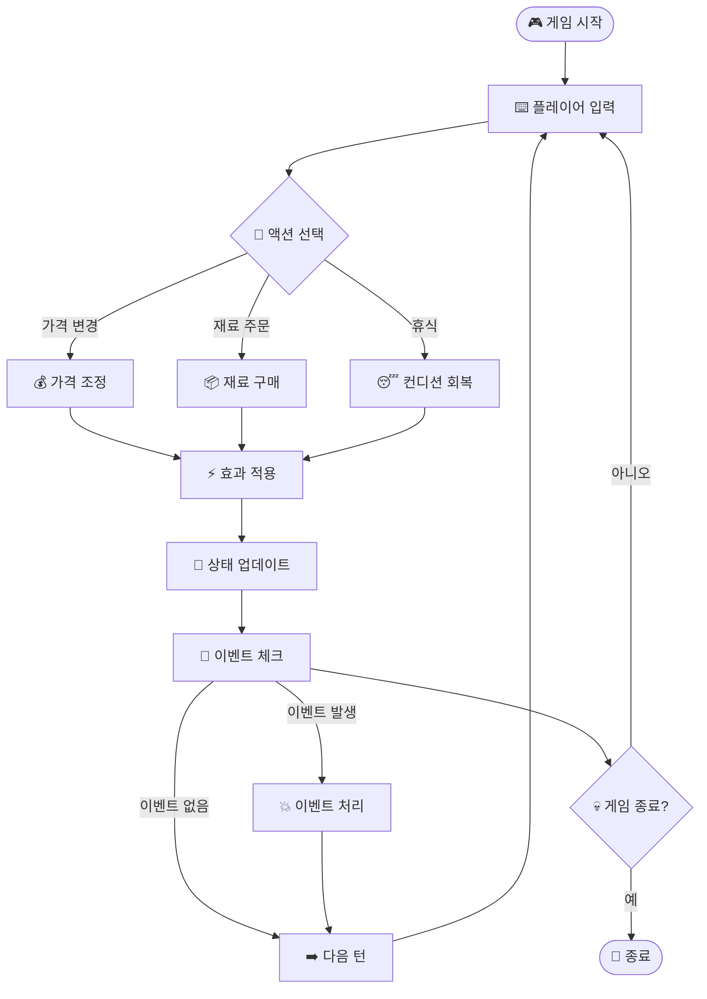
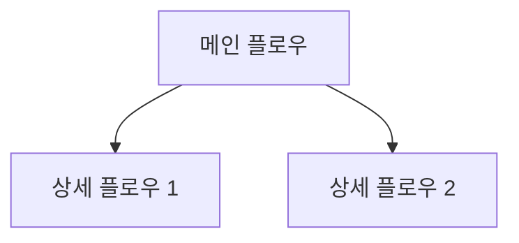
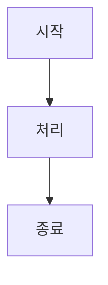
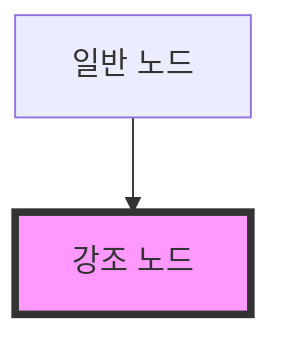

# 🎨 Mermaid 다이어그램 가이드

이 문서는 Mermaid를 사용하여 다이어그램을 생성하고 관리하는 방법을 안내합니다.

## 🌐 온라인 도구 추천

### 1. **Mermaid Live Editor** (무료) 🔥 추천!
- **URL**: https://mermaid.live/
- **특징**: 
  - 실시간 미리보기
  - 다양한 다이어그램 타입
  - PNG/SVG 다운로드 가능
  - 코드만 입력하면 즉시 생성

### 2. **Draw.io (diagrams.net)** (무료) ⭐
- **URL**: https://app.diagrams.net/
- **특징**:
  - 드래그 앤 드롭 방식
  - 매우 직관적인 UI
  - 다양한 템플릿
  - 구글 드라이브/원드라이브 연동

### 3. **PlantUML Online** (무료)
- **URL**: http://www.plantuml.com/plantuml/
- **특징**:
  - 텍스트 기반 다이어그램
  - UML 전문
  - 간단한 문법

## 🛠️ 로컬 개발 환경

### VS Code 확장 설치
```bash
# Mermaid Preview 확장 설치
code --install-extension bierner.markdown-mermaid
```

### Mermaid CLI 설치
```bash
# Node.js 필요
npm install -g @mermaid-js/mermaid-cli

# 다이어그램을 이미지로 변환
mmdc -i diagram.mmd -o diagram.png
mmdc -i diagram.mmd -o diagram.svg
```

## 📝 Mermaid 문법 가이드

### 📊 플로우차트 (Flowchart)


### 📈 시퀀스 다이어그램 (Sequence)


### 🏗️ 클래스 다이어그램 (Class)


### 🗂️ 상태 다이어그램 (State)


### 📅 간트 차트 (Gantt)


## 🎯 프로젝트 스타일 가이드

### 📐 우리 프로젝트 컨벤션

1. **이모지 사용** 🎨
   - 각 노드에 의미를 나타내는 이모지 추가
   - 가독성과 직관성 향상

2. **색상 그룹핑**
   ```mermaid
   graph TD
       subgraph "🏛️ Core Domain"
           A[GameState]
           B[Metrics]
       end
       
       subgraph "🔗 Adapters"
           C[ExcelProvider]
           D[MetricsTracker]
       end
   ```

3. **명확한 라벨링**
   - 화살표에 조건이나 설명 추가
   - `-->|조건| 대상노드` 형식 사용

4. **서브그래프 활용**
   - 관련 기능들을 그룹화
   - 레이어별 구분

### 🔤 네이밍 컨벤션

| 요소 | 형식 | 예시 |
|------|------|------|
| 노드명 | PascalCase | `GameState`, `EventEngine` |
| 변수/함수 | snake_case | `apply_effects`, `get_constant` |
| 파일명 | snake_case | `system_architecture.md` |
| 브랜치 라벨 | 한글 OK | `-->|유효함|`, `-->|예|` |

## 🚀 실습 예제

### 간단한 게임 플로우


## 💡 팁과 트릭

### 1. **실시간 편집**
- Mermaid Live Editor에서 코드 작성
- 실시간으로 결과 확인
- 완성되면 복사하여 마크다운에 붙여넣기

### 2. **복잡한 다이어그램 분할**


### 3. **링크 연결**


### 4. **스타일링**


## 🔧 문제 해결

### 자주 발생하는 오류

1. **문법 오류**
   ```
   Parse error on line X
   ```
   - 괄호, 화살표 문법 확인
   - 특수문자 이스케이프 필요 시 `"` 사용

2. **한글 깨짐**
   - UTF-8 인코딩 확인
   - 파일 저장 시 인코딩 설정

3. **복잡한 다이어그램 렌더링 실패**
   - 노드 수 줄이기
   - 서브그래프로 분할

### 디버깅 방법

1. **단계별 작성**
   - 기본 구조부터 시작
   - 점진적으로 복잡도 증가

2. **온라인 에디터 활용**
   - Mermaid Live Editor에서 검증
   - 오류 메시지 확인

3. **문법 참조**
   - 공식 문서: https://mermaid-js.github.io/mermaid/
   - 예제 모음: https://mermaid.js.org/syntax/examples.html

## 📚 추가 학습 자료

### 공식 문서
- [Mermaid 공식 사이트](https://mermaid-js.github.io/mermaid/)
- [GitHub Repository](https://github.com/mermaid-js/mermaid)

### 튜토리얼
- [Mermaid Cheat Sheet](https://jojozhuang.github.io/tutorial/mermaid-cheat-sheet/)
- [Visual Studio Code + Mermaid](https://marketplace.visualstudio.com/items?itemName=bierner.markdown-mermaid)

### 커뮤니티
- [Stack Overflow - Mermaid](https://stackoverflow.com/questions/tagged/mermaid)
- [Reddit - r/dataisbeautiful](https://www.reddit.com/r/dataisbeautiful/)

---

🎨 **아름다운 다이어그램으로 복잡한 시스템을 쉽게 이해시키세요!** 🎨 