# 🏗️ 시스템 전체 구조도

Chickenmaster 프로젝트의 헥사고널 아키텍처 전체 구조를 시각화합니다.

## 📐 헥사고널 아키텍처 구조

```mermaid
graph TB
    subgraph "��️ UI Layer"
        WebUI[🌐 web_prototype/main.py<br/>웹 인터페이스]
        WebAPI[🔌 FastAPI 웹 서버]
    end
    
    subgraph "🎭 Application Layer"
        AppService[🎭 Application Services]
        GamePhil[🧠 GamePhilosophyService<br/>게임 철학 적용]
        ResearchService[🧪 ResearchService<br/>연구 관리]
    end
    
    subgraph "🏛️ Core Domain"
        subgraph "📊 Domain Models"
            GameState[🎯 GameState<br/>frozen dataclass]
            Metrics[📊 Metrics<br/>frozen dataclass]
            Events[🎲 Events<br/>frozen dataclass]
            Research[🧪 Research<br/>frozen dataclass]
            ActionSlots[⚡ ActionSlots<br/>frozen dataclass]
        end
        
        subgraph "🔌 Ports (Interfaces)"
            MetricPort[📊 MetricPort]
            EventPort[🎲 EventPort]
            StoragePort[💾 StoragePort]
            ResearchPort[🧪 ResearchPort]
            CascadePort[🌊 CascadePort]
            ContainerPort[📦 ContainerPort]
        end
    end
    
    subgraph "🔗 Adapters Layer"
        subgraph "📊 Metrics Adapters"
            MetricsTracker[📈 MetricsTracker<br/>지표 추적 및 계산]
            MetricsModifier[🔧 MetricsModifier<br/>지표 변경 로직]
        end
        
        subgraph "💾 Storage Adapters"
            ExcelProvider[📋 ExcelGameDataProvider<br/>엑셀 데이터 로드]
            StorageAdapter[💾 StorageAdapter<br/>데이터 저장]
        end
        
        subgraph "🧪 Research Adapters"
            ResearchAdapter[🧪 ResearchAdapter<br/>연구 시스템 구현]
        end
        
        subgraph "🎲 Event Adapters"
            EventService[🎲 EventService<br/>이벤트 처리 서비스]
        end
    end
    
    subgraph "🛠️ Infrastructure"
        subgraph "🎲 Event System"
            EventEngine[🎲 EventEngine<br/>이벤트 엔진]
            EventModels[📋 EventModels<br/>이벤트 스키마]
            EventValidators[✅ EventValidators<br/>이벤트 검증]
        end
        
        subgraph "💰 Economy System"
            EconomyEngine[💰 EconomyEngine<br/>경제 계산]
            EconomyModels[📈 EconomyModels<br/>경제 모델]
        end
        
        subgraph "🌊 Cascade System"
            CascadeDomain[🌊 CascadeDomain<br/>연쇄 효과 도메인]
            CascadePorts[🔌 CascadePorts<br/>연쇄 효과 인터페이스]
            CascadeAdapters[🔗 CascadeAdapters<br/>연쇄 효과 구현]
        end
        
        subgraph "📖 Storyteller System"
            StorytellerDomain[📖 StorytellerDomain<br/>스토리 도메인]
            StorytellerPorts[🔌 StorytellerPorts<br/>스토리 인터페이스]
            StorytellerAdapters[🔗 StorytellerAdapters<br/>스토리 구현]
        end
        
        subgraph "📊 Excel Constants System"
            ExcelLoader[📋 ExcelConstantsLoader<br/>엑셀 상수 로더]
            ConstantCache[💾 Constants Cache<br/>상수 캐시]
            DynamicReload[🔄 Dynamic Reload<br/>런타임 재로드]
        end
    end
    
    subgraph "📁 Data Layer"
        ExcelFiles[📊 Excel Files<br/>game_initial_values*.xlsx]
        TomlFiles[📝 TOML Files<br/>events.toml, tradeoff_matrix.toml]
        JsonFiles[📄 JSON Files<br/>economy_config.json]
        Constants[📋 game_constants.py<br/>동적 상수 관리]
    end
    
    subgraph "🧪 Testing"
        UnitTests[🔬 Unit Tests<br/>각 모듈별 단위 테스트]
        IntegrationTests[🔗 Integration Tests<br/>시스템 통합 테스트]
        TestFixtures[🛠️ Test Fixtures<br/>테스트 데이터]
    end
    
    %% UI → Application
    WebUI --> AppService
    WebAPI --> AppService
    
    %% Application → Core
    AppService --> GameState
    AppService --> Metrics
    AppService --> Events
    GamePhil --> GameState
    ResearchService --> Research
    
    %% Application → Adapters (through Ports)
    AppService -.-> MetricPort
    AppService -.-> EventPort
    AppService -.-> StoragePort
    
    %% Ports → Adapters (Implementation)
    MetricPort -.-> MetricsTracker
    EventPort -.-> EventService
    StoragePort -.-> ExcelProvider
    ResearchPort -.-> ResearchAdapter
    CascadePort -.-> CascadeAdapters
    
    %% Adapters → Infrastructure
    MetricsTracker --> EventEngine
    EventService --> EventEngine
    ExcelProvider --> ExcelFiles
    
    %% Infrastructure Internal
    EventEngine --> EventModels
    EventEngine --> EventValidators
    EventEngine --> EconomyEngine
    EventEngine --> CascadeDomain
    EventEngine --> StorytellerDomain
    
    %% Excel Constants System
    ExcelProvider --> ExcelLoader
    ExcelLoader --> ConstantCache
    ConstantCache --> DynamicReload
    DynamicReload --> Constants
    
    %% Data Dependencies
    EventEngine --> TomlFiles
    EconomyEngine --> JsonFiles
    MetricsTracker --> Constants
    ExcelProvider --> ExcelFiles
    ExcelLoader --> ExcelFiles
    
    %% Testing Dependencies
    UnitTests --> GameState
    UnitTests --> Metrics
    UnitTests --> EventEngine
    IntegrationTests --> AppService
    TestFixtures --> UnitTests
```

## 🎯 아키텍처 핵심 원칙

### 1. **의존성 방향** (Dependency Direction)
- 외부 → 내부 방향으로만 의존
- Core Domain은 다른 레이어에 의존하지 않음
- Ports를 통한 인터페이스 추상화

### 2. **불변성 보장** (Immutability)
- 모든 도메인 객체는 `frozen dataclass`
- 상태 변경은 새 객체 생성으로 처리
- 사이드 이펙트 최소화

### 3. **동적 설정 관리** (Dynamic Configuration)
- 엑셀 기반 상수 관리
- 런타임 재로드 지원
- 코드 수정 없는 밸런싱

### 4. **이벤트 주도 설계** (Event-Driven)
- 모든 게임 로직은 이벤트로 처리
- 연쇄 효과 시스템
- 트레이드오프 메커니즘

## 🔄 데이터 흐름

1. **초기화**: Excel → Constants → Domain Models
2. **게임 플레이**: UI → Application → Domain → Infrastructure
3. **상태 변경**: Events → Cascade → Metrics Update
4. **실시간 조정**: Excel 수정 → Reload → 즉시 반영

## 🎮 게임 철학 반영

- **정답 없음**: 모든 선택이 트레이드오프
- **불확실성**: 예측 불가능한 이벤트
- **동적 밸런싱**: 실시간 게임 조정 