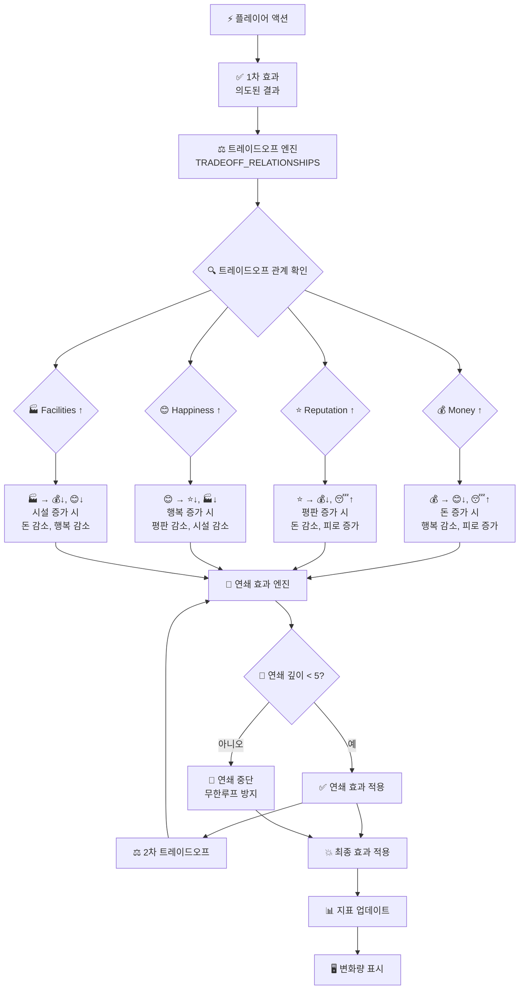
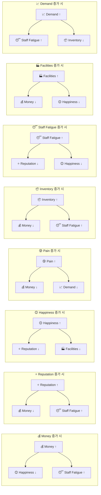
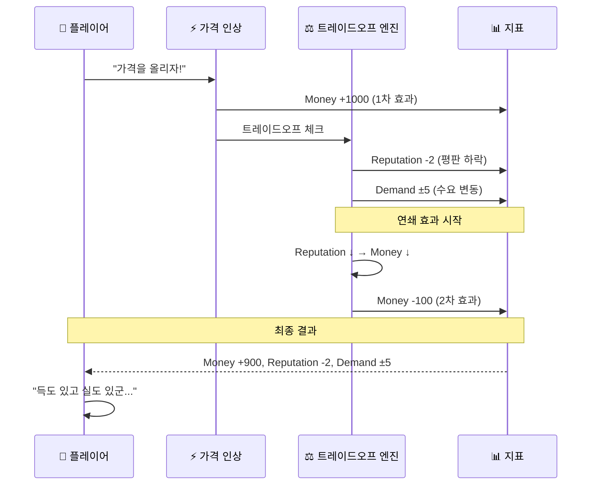
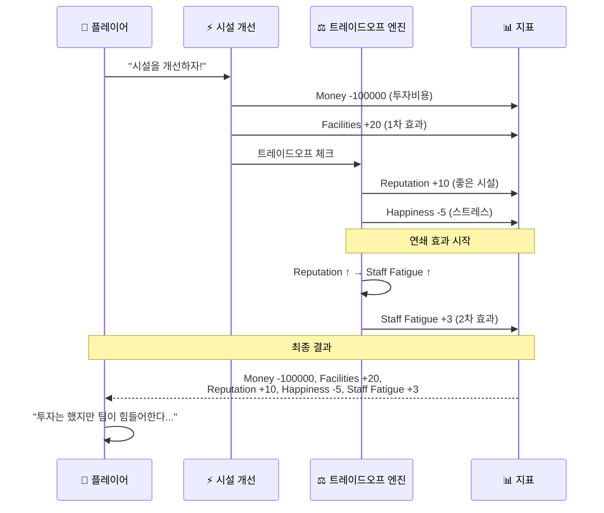
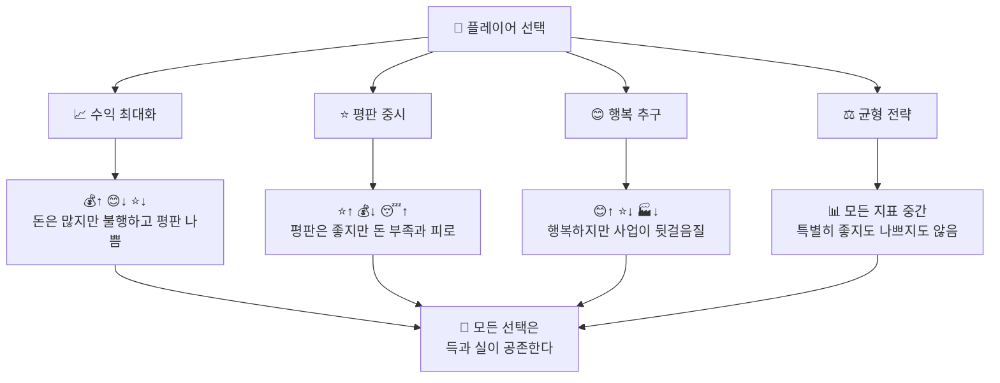
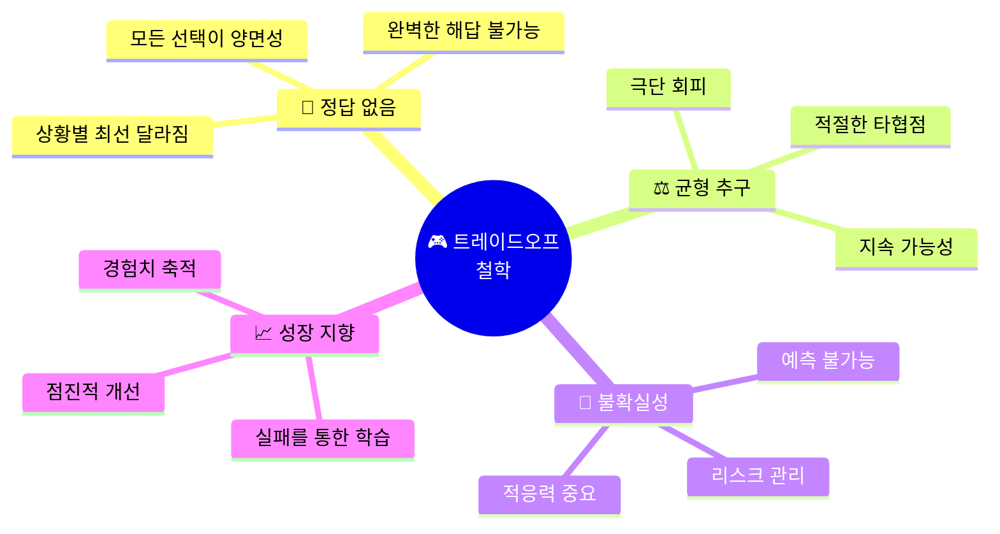

# ⚖️ 트레이드오프 시스템

🎯 **"정답 없는 게임"의 핵심 메커니즘!**  
모든 선택이 득과 실을 동시에 가져오는 트레이드오프 시스템을 시각화합니다.

## ⚖️ 트레이드오프 메커니즘



## 📊 트레이드오프 관계 매트릭스



## 🎮 구체적인 게임 시나리오

### 💰 가격 인상 시나리오



### 🏭 시설 개선 시나리오



## 🎲 불확실성 요소

```mermaid
graph TD
    BaseEffect[📊 기본 트레이드오프] --> UncertaintyWeights[🎲 불확실성 가중치<br/>UNCERTAINTY_WEIGHTS]
    
    UncertaintyWeights --> MoneyWeight[💰 Money: 0.8<br/>80% 확률로 예상대로]
    UncertaintyWeights --> RepWeight[⭐ Reputation: 0.6<br/>60% 확률로 예상대로]
    UncertaintyWeights --> HappyWeight[😊 Happiness: 0.4<br/>40% 확률로 예상대로]
    
    MoneyWeight --> MoneyResult{🎯 random() < 0.8?}
    RepWeight --> RepResult{🎯 random() < 0.6?}
    HappyWeight --> HappyResult{🎯 random() < 0.4?}
    
    MoneyResult -->|예| MoneyExpected[💰 예상 효과 적용]
    MoneyResult -->|아니오| MoneyUnexpected[💰 반대 효과 또는 무효과]
    
    RepResult -->|예| RepExpected[⭐ 예상 효과 적용]
    RepResult -->|아니오| RepUnexpected[⭐ 예상치 못한 결과]
    
    HappyResult -->|예| HappyExpected[😊 예상 효과 적용]
    HappyResult -->|아니오| HappyUnexpected[😊 완전히 다른 결과]
    
    MoneyExpected --> FinalOutcome[🎯 최종 결과]
    MoneyUnexpected --> FinalOutcome
    RepExpected --> FinalOutcome
    RepUnexpected --> FinalOutcome
    HappyExpected --> FinalOutcome
    HappyUnexpected --> FinalOutcome
```

## 🧠 게임 철학 구현

### 🚫 정답 없음 (No Right Answer)



### ⚖️ 트레이드오프 철학



## 🔧 밸런싱 레버

### 📊 상수 조정을 통한 게임 밸런싱

```mermaid
graph TD
    BalancingTeam[🎨 밸런싱 팀] --> ExcelFile[📊 Excel 파일 수정]
    
    ExcelFile --> TradeoffSheet[🔄 Tradeoff_Relationships<br/>트레이드오프 강도 조정]
    ExcelFile --> UncertaintySheet[🎲 Uncertainty_Weights<br/>불확실성 레벨 조정]
    ExcelFile --> ThresholdSheet[⚖️ Threshold_Constants<br/>임계값 조정]
    
    TradeoffSheet --> Example1[💰 Money → 😊 Happiness<br/>-0.5 → -0.3 (완화)]
    UncertaintySheet --> Example2[😊 Happiness Weight<br/>0.4 → 0.6 (더 예측 가능)]
    ThresholdSheet --> Example3[MONEY_LOW_THRESHOLD<br/>3000 → 5000 (더 까다롭게)]
    
    Example1 --> ReloadConstants[🔄 reload_all_constants()]
    Example2 --> ReloadConstants
    Example3 --> ReloadConstants
    
    ReloadConstants --> TestPlay[🎮 테스트 플레이]
    TestPlay --> FeedbackLoop[📝 피드백 수집]
    FeedbackLoop --> BalancingTeam
```

## 💡 설계 원칙

### ✅ Do's (해야 할 것)

1. **명확한 인과관계** - 모든 트레이드오프는 논리적 근거가 있어야 함
2. **플레이어 이해** - 트레이드오프 결과가 예측 가능해야 함  
3. **밸런스 유지** - 어떤 전략도 완전히 지배적이지 않아야 함
4. **점진적 조정** - 급격한 변화보다는 부드러운 조정

### ❌ Don'ts (하지 말아야 할 것)

1. **무의미한 페널티** - 논리적 근거 없는 불이익
2. **예측 불가능** - 완전히 랜덤한 결과
3. **극단적 불균형** - 한쪽으로 치우친 트레이드오프
4. **복잡성 과다** - 이해하기 어려운 복잡한 연쇄

## 🎯 성공 지표

### 📊 밸런싱 품질 지표

| 지표 | 목표 값 | 설명 |
|------|---------|------|
| 전략 다양성 | > 4가지 | 플레이어가 선택할 수 있는 유효한 전략 수 |
| 게임 길이 | 15-30일 | 평균 생존 일수 |
| 선택의 고민 시간 | 10-30초 | 플레이어가 고민하는 평균 시간 |
| 재플레이 의향 | > 70% | 게임 종료 후 다시 플레이하고 싶은 비율 |
| 트레이드오프 이해도 | > 80% | 플레이어가 트레이드오프를 이해하는 비율 |

⚖️ **"모든 선택이 딜레마가 되는 게임"의 핵심 시스템!** ⚖️ 