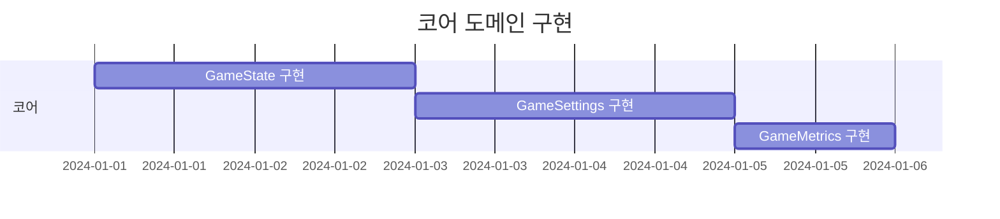
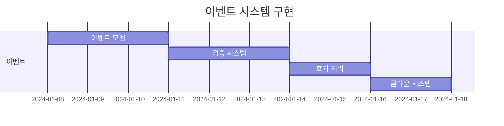
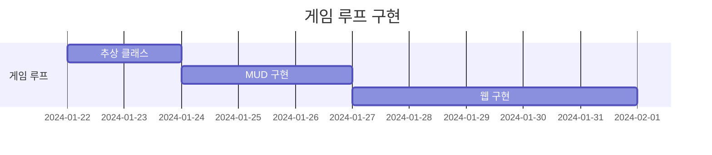
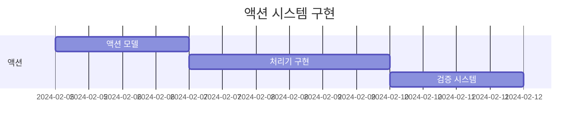
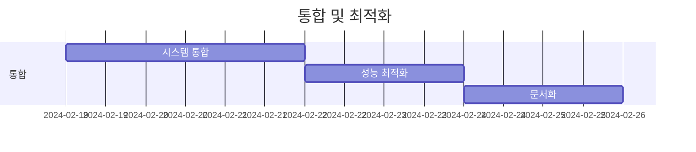

# 구현 계획

## 1. 작업 순서

### 1.1 코어 도메인 구현 (1주차)

1. 불변 객체 구현
   - GameState 클래스
   - GameSettings 클래스
   - GameMetrics 클래스

2. 도메인 서비스 구현
   - GameStateService
   - MetricsService

3. 테스트 구현
   - 단위 테스트
   - 통합 테스트

### 1.2 이벤트 시스템 구현 (2-3주차)

1. 이벤트 엔진 구현
   - EventEngine 클래스
   - EventProcessor 클래스
   - EventValidator 클래스

2. 트리거 시스템 구현
   - TriggerValidator
   - TriggerProcessor

3. 효과 시스템 구현
   - EffectHandler
   - StateUpdater

4. 테스트 구현
   - 이벤트 처리 테스트
   - 트리거 테스트
   - 효과 테스트

### 1.3 게임 루프 구현 (4-5주차)

1. 추상 게임 루프 구현
   - AbstractGameLoop
   - StateManager
   - EventProcessor

2. MUD 게임 루프 구현
   - MUDGameLoop
   - MUDRenderer
   - CommandProcessor

3. 웹 게임 루프 구현
   - WebGameLoop
   - WebRenderer
   - RequestHandler

### 1.4 액션 시스템 구현 (6주차)

1. 액션 모델 구현
   - GameAction 클래스
   - ActionEffect 클래스
   - ActionResult 클래스

2. 액션 처리기 구현
   - ActionProcessor
   - ActionValidator
   - EffectApplier

3. 테스트 구현
   - 액션 처리 테스트
   - 효과 적용 테스트
   - 검증 테스트

### 1.5 메트릭스 시스템 구현 (7주차)

1. 지표 모델 구현
   - MetricDefinition
   - MetricValue
   - MetricHistory

2. 추적 시스템 구현
   - MetricsTracker
   - MetricsAnalyzer
   - MetricsReporter

3. 테스트 구현
   - 지표 계산 테스트
   - 추적 시스템 테스트
   - 보고서 생성 테스트

### 1.6 통합 및 최적화 (8주차)

1. 시스템 통합
   - 컴포넌트 통합
   - 인터페이스 정리
   - 의존성 검토

2. 성능 최적화
   - 병목 지점 분석
   - 메모리 사용 최적화
   - 처리 시간 개선

3. 최종 테스트
   - 통합 테스트
   - 성능 테스트
   - 사용성 테스트

## 2. 우선순위

### 2.1 핵심 기능 (P0)
- 게임 상태 관리
- 이벤트 처리
- 기본 게임 루프

### 2.2 중요 기능 (P1)
- 액션 시스템
- 메트릭스 추적
- 웹 인터페이스

### 2.3 부가 기능 (P2)
- 고급 분석 도구
- 성능 최적화
- 확장 기능

## 3. 위험 요소

### 3.1 기술적 위험
- 순환 참조 문제
- 메모리 누수
- 성능 저하

### 3.2 관리적 위험
- 일정 지연
- 요구사항 변경
- 리소스 부족

## 4. 품질 관리

### 4.1 코드 품질
- 정적 분석 도구 사용
- 코드 리뷰 진행
- 문서화 유지

### 4.2 테스트 커버리지
- 단위 테스트 80% 이상
- 통합 테스트 구현
- 성능 테스트 수행 