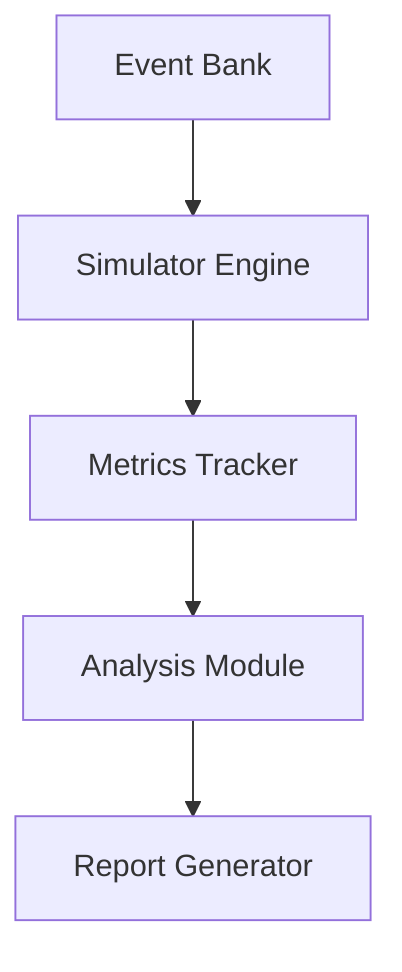

# 밸런스 시뮬레이터

## 개요

밸런스 시뮬레이터는 Chicken-RNG의 게임 밸런스를 자동으로 검증하고 조정하는 도구입니다. 이 시스템은 다음과 같은 주요 기능을 제공합니다:

- 게임 시뮬레이션 실행
- 밸런스 메트릭 측정
- 통계 분석 및 리포팅
- 밸런스 조정 추천

## 아키텍처

### 핵심 컴포넌트



### 주요 모듈
- **Simulator Engine**: 게임 로직 시뮬레이션
- **Metrics Tracker**: 게임 지표 추적
- **Analysis Module**: 데이터 분석
- **Report Generator**: 결과 리포트 생성

## 시뮬레이션 설정

### 기본 파라미터
- 시뮬레이션 횟수: 1000회
- 시드값 범위: 100개
- 최대 턴 수: 365
- 메모리 제한: 256MB

### 측정 지표
- 파산율
- 평균 생존 일수
- 지표 균형도
- 이벤트 발생 분포

## 밸런스 검증

### 핵심 지표
- **파산율**: 0-5% 목표
- **생존율**: 95% 이상
- **지표 균형**: 행복+고통=100 유지
- **최대 연쇄**: 깊이 5 이하

### 품질 메트릭
- **다양성 점수**: ≥ 0.8
- **트레이드오프**: ≥ 0.9
- **문화적 진정성**: ≥ 0.7

## 분석 기능

### 통계 분석
- 생존 곡선 분석
- 지표 상관관계
- 이벤트 영향도

### 시각화
- 시계열 그래프
- 히트맵
- 상관관계 매트릭스

### 리포팅
- CSV 데이터 출력
- PNG 그래프 생성
- 마크다운 리포트

## 밸런스 조정

### 자동 조정
- 효과 크기 스케일링
- 발생 확률 조정
- 임계값 최적화

### 수동 조정 가이드
- 위험 지표 식별
- 조정 방향 제시
- 예상 효과 분석

## 사용 방법

### CLI 명령어
```bash
# 기본 시뮬레이션
python -m dev_tools.balance_simulator

# 상세 분석
python -m dev_tools.balance_simulator --detailed

# 특정 이벤트 분석
python -m dev_tools.balance_simulator --event EVENT_ID
```

### 설정 파일
```toml
[simulation]
runs = 1000
seeds = 100
max_turns = 365

[metrics]
bankruptcy_threshold = 0.05
happiness_balance = true
max_cascade_depth = 5

[reporting]
output_format = ["csv", "png", "md"]
detailed = false
```

## 성능 최적화

### 메모리 관리
- 제너레이터 패턴 사용
- 점진적 데이터 처리
- 캐시 최적화

### 실행 속도
- 병렬 처리 지원
- 배치 프로세싱
- 조기 종료 조건

## 확장성

### 플러그인 시스템
- 커스텀 메트릭 추가
- 분석 모듈 확장
- 리포트 템플릿

### API 통합
- REST API 지원
- 웹훅 통합
- 실시간 모니터링

## 운영 가이드

### 정기 검증
- 일일 밸런스 체크
- 주간 상세 분석
- 월간 트렌드 분석

### 문제 해결
- 일반적인 문제
- 디버깅 가이드
- 성능 튜닝

### 모범 사례
- 설정 최적화
- 리소스 관리
- 결과 해석 