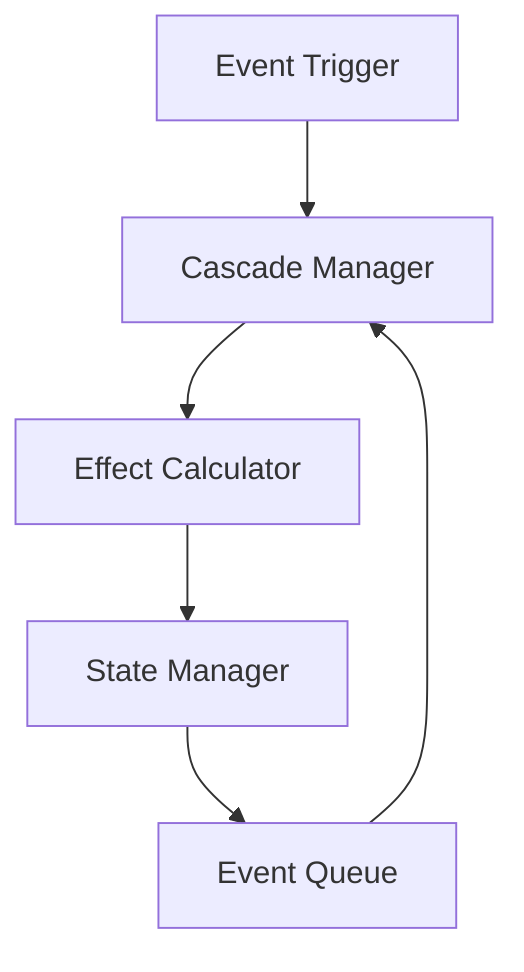

# 캐스케이드 시스템

## 개요

캐스케이드 시스템은 Chicken-RNG의 연쇄 효과를 관리하는 핵심 인프라입니다. 이 시스템은 이벤트 간의 복잡한 상호작용과 연쇄적인 효과를 처리합니다.

## 아키텍처

### 핵심 컴포넌트



### 주요 모듈
- **Cascade Manager**: 연쇄 효과 조정
- **Effect Calculator**: 효과 계산
- **State Manager**: 상태 관리
- **Event Queue**: 이벤트 큐

## 데이터 구조

### 이벤트 노드
```python
@dataclass
class EventNode:
    id: str
    type: EventType
    effects: List[Effect]
    children: List[EventNode]
    depth: int
    probability: float
```

### 효과 정의
```python
@dataclass
class Effect:
    metric: str
    formula: str
    conditions: List[Condition]
    probability: float
```

## 핵심 기능

### 1. 연쇄 효과 처리
- DAG 기반 이벤트 추적
- 순환 참조 방지
- 깊이 제한 관리

### 2. 효과 계산
- 수식 평가
- 확률 계산
- 조건부 실행

### 3. 상태 관리
- 스냅샷 생성
- 롤백 지원
- 트랜잭션 관리

## 구현 세부사항

### 연쇄 효과 관리자
```python
class CascadeManager:
    def __init__(self, max_depth: int = 5):
        self.max_depth = max_depth
        self.current_chain: List[EventNode] = []
    
    def process_cascade(self, event: Event) -> List[Effect]:
        # 구현 세부사항
        ...

    def validate_chain(self, chain: List[EventNode]) -> bool:
        # 구현 세부사항
        ...
```

### 효과 계산기
```python
class EffectCalculator:
    def calculate(self, effect: Effect, state: GameState) -> float:
        # 구현 세부사항
        ...
    
    def apply_probability(self, value: float, prob: float) -> float:
        # 구현 세부사항
        ...
```

## 성능 최적화

### 메모리 관리
- 이벤트 캐싱
- 메모리 풀링
- 가비지 컬렉션

### 실행 최적화
- 병렬 처리
- 지연 로딩
- 배치 처리

## 모니터링

### 메트릭
- 연쇄 깊이
- 실행 시간
- 메모리 사용량

### 로깅
- 이벤트 추적
- 오류 기록
- 성능 데이터

## 확장성

### 플러그인 시스템
- 커스텀 효과
- 사용자 정의 규칙
- 외부 시스템 통합

### 설정 관리
- 환경 변수
- 설정 파일
- 동적 설정

## 사용 예시

### 기본 사용
```python
cascade_manager = CascadeManager()
effects = cascade_manager.process_cascade(event)
```

### 고급 설정
```python
config = CascadeConfig(
    max_depth=7,
    probability_threshold=0.1,
    enable_caching=True
)
cascade_manager = CascadeManager(config)
```

## 테스트

### 단위 테스트
```python
def test_cascade_depth():
    manager = CascadeManager(max_depth=3)
    event = create_test_event()
    effects = manager.process_cascade(event)
    assert max(e.depth for e in effects) <= 3
```

### 통합 테스트
```python
def test_full_chain():
    manager = CascadeManager()
    state = GameState()
    event = create_complex_event()
    effects = manager.process_cascade(event)
    assert validate_state(state, effects)
```

## 문제 해결

### 일반적인 문제
1. 순환 참조
2. 메모리 누수
3. 성능 저하

### 해결 방법
1. 그래프 검증
2. 메모리 모니터링
3. 성능 프로파일링

## 운영 가이드

### 설정 최적화
- 깊이 제한 조정
- 캐시 크기 설정
- 로깅 레벨 관리

### 모니터링
- 성능 추적
- 오류 감지
- 리소스 사용량

### 유지보수
- 정기 검사
- 성능 튜닝
- 버그 수정 